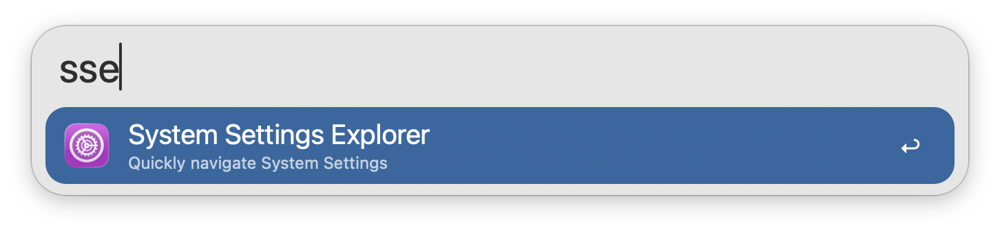
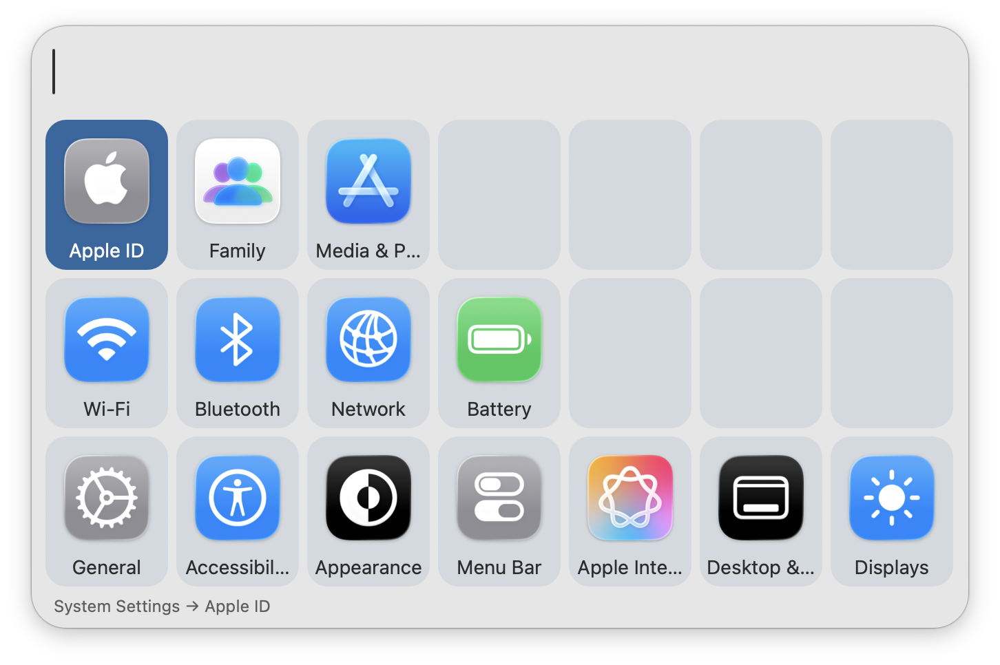
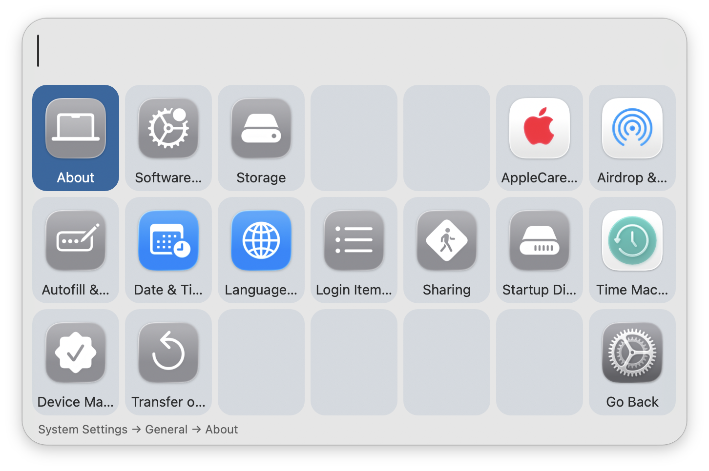

## Usage

View and search for System Settings panes via the `sse` keyword.

Select a settings pane to open in System Settings. Scroll through results or type to filter.

* <kbd>↩</kbd> Open selected pane in System Settings.
* <kbd>⌘</kbd><kbd>↩</kbd> Open nested pane directly in System Settings.

Nested panes, such as `General` and `Accessibility`, contain additional settings browsable within Alfred. These settings can also be selectively included in the main search results from the Workflow's Configuration.

* <kbd>↩</kbd> Open selected pane in System Settings.
* <kbd>⇧</kbd><kbd>↩</kbd> Return to main search results.

Settings are searchable using natural language and related keywords. For example, `and` matches `&`, and `Mission Control` matches its parent setting `Desktop & Dock`.

Configure the Hotkey as a faster shortcut to view settings panes.
