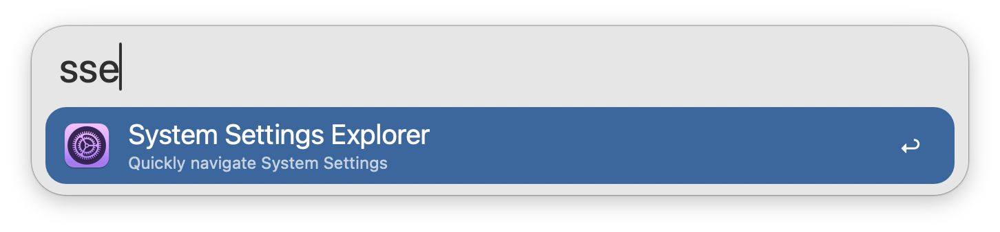

## Usage

View and search for System Settings panes with the `sse` keyword.

Select the desired menu to open in System Settings. Scroll through results or type to filter.

* <kbd>↩</kbd> Open selected pane in System Settings.
* <kbd>⌘</kbd><kbd>↩</kbd> Open nested pane directly in System Settings.

Nested panes such as `General` and `Accessibility` have more settings panes nested within them. These panes are browsable within Alfred, but can be opened directly with <kbd>⌘</kbd><kbd>↩</kbd>. They can also be selectively included in the main search results from the Workflow's Configuration.

Natural language and sub-settings search are supported, so `and` matches `&` and `Mission Control` matches its parent pane `Desktop & Dock`.

Configure the Hotkey as a faster shortcut to view settings panes.
