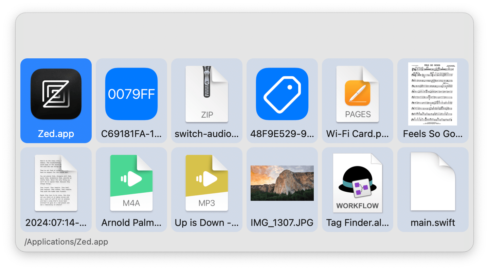

## Usage

Search for tags via the `tagfinder` keyword.

* <kbd>↩</kbd> Show files in Alfred.
* <kbd>⌘</kbd><kbd>↩</kbd> Show files in a Finder window.

* <kbd>↩</kbd> Open file.
* <kbd>⌘</kbd><kbd>↩</kbd> Reveal file in Finder.
* <kbd>⇧</kbd><kbd>↩</kbd> Return to Tag List.
* <kbd>⌘</kbd><kbd>Y</kbd> Quick Look file.

File previews are configurable in the Workflow’s Configuration in addition to the number of columns they take up.
