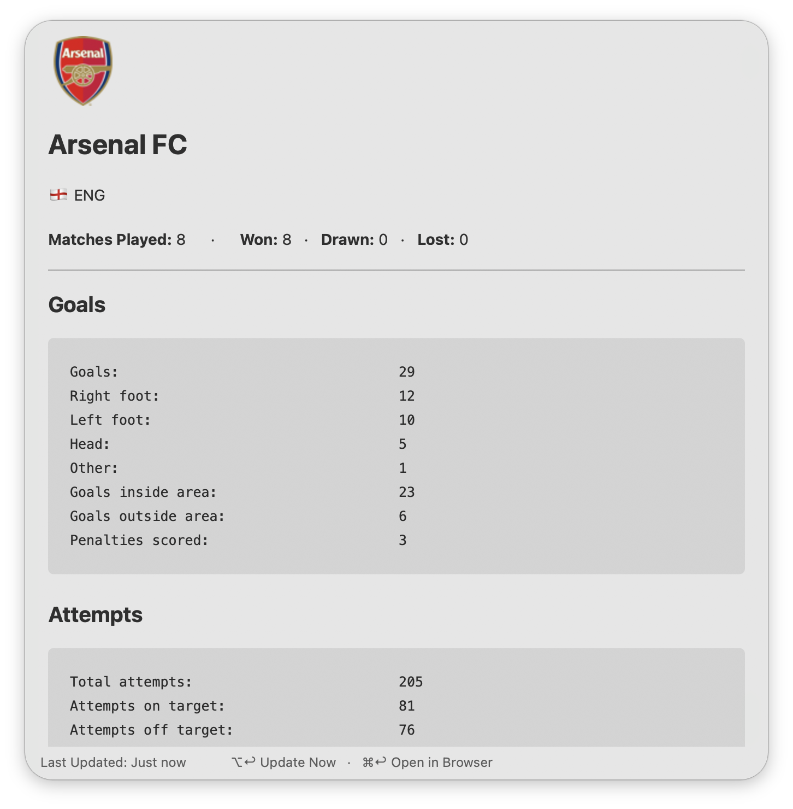
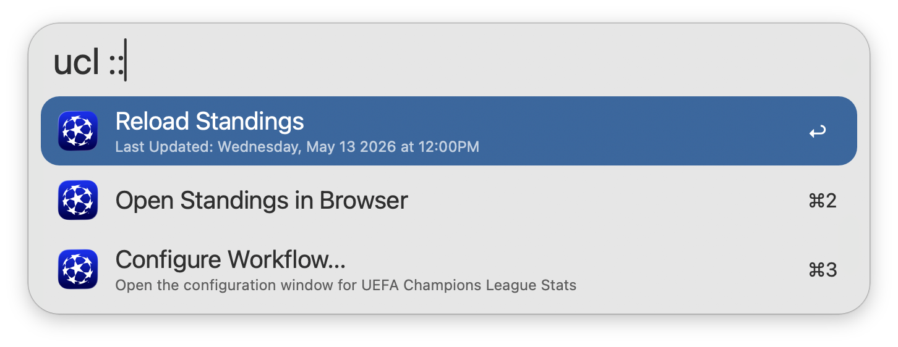

## Usage

View the latest [UEFA Champions League](https://www.uefa.com/uefachampionsleague/) standings via the `ucl` keyword. Type to filter by Team, Rank, Country, or Qualified.

* <kbd>↩</kbd> View Team Stats in Alfred.
* <kbd>⌘</kbd><kbd>↩</kbd> Open Team Stats in Browser.

Additional Team Stats can be viewed directly within Alfred. This includes Goals, Attempts, Distribution, Attacking, Defending, Goalkeeping, and Disciplinary Stats.

* <kbd>⌘</kbd><kbd>↩</kbd> Open in Browser.
* <kbd>⌥</kbd><kbd>↩</kbd> Refresh Team Stats.

Append `::` to the configured Keyword to access other actions, such as manually reloading the standings cache.

Configure the Hotkey as a shortcut for viewing standings.
