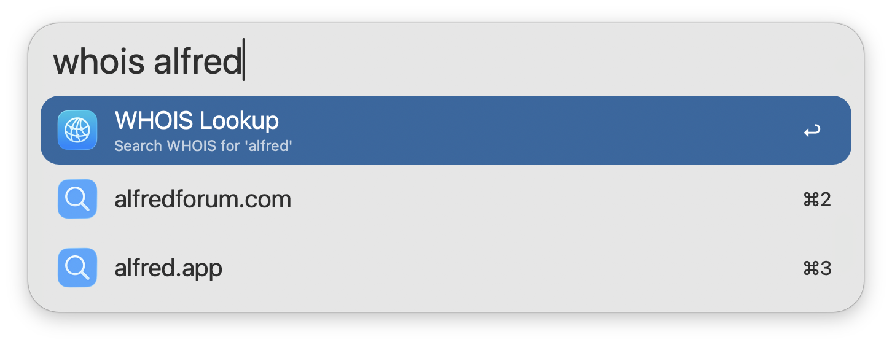
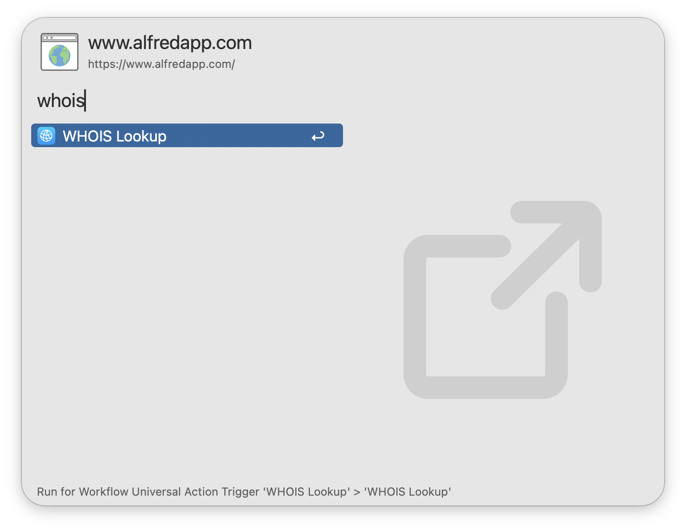

## Usage

Perform a [WHOIS](https://en.wikipedia.org/wiki/WHOIS) lookup via the `whois` keyword. Type the domain, IP address, or IP range you would like to query.

* <kbd>↩</kbd> View WHOIS data in Alfred’s Text View.
* <kbd>⌘</kbd><kbd>↩</kbd> View raw WHOIS data in a text file.

Autocomplete previous lookups by pressing tab or selecting from the search suggestions. By default, the first suggestion will be tab-completed.

When viewing a WHOIS response, the Text View can selectively summarize key information before showing the raw data, configurable from the Workflow's Configuration.

* <kbd>⌘</kbd><kbd>↩</kbd> Open raw WHOIS data in a text file.
* <kbd>⌥</kbd><kbd>↩</kbd> Refresh WHOIS data (Lookups are cached for 6 hours).

Configure the Hotkey as a shortcut to perform a WHOIS lookup. Use the Universal Action to query URLs from Alfred’s Clipboard History or selected text.

