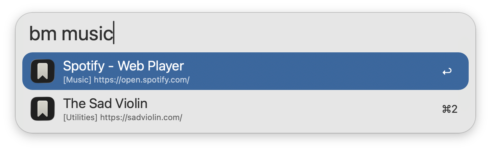
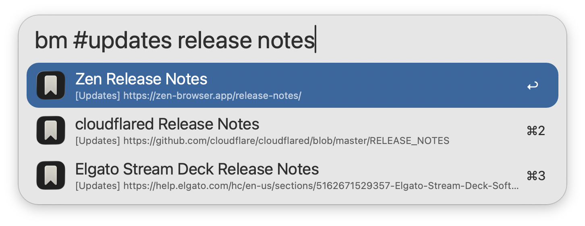
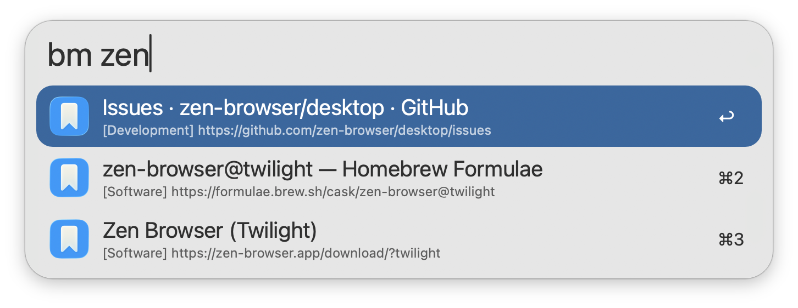
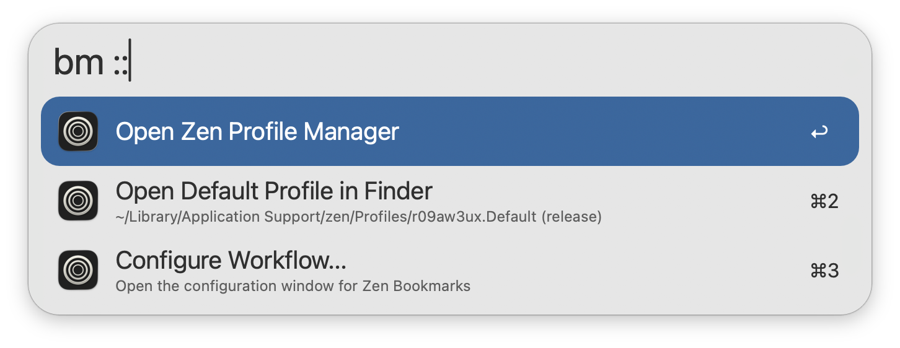

## Usage

Search for your [Zen](https://zen-browser.app/) bookmarks via the `bm` keyword. Type to refine your search.

Bookmarks are always searchable by Name, while filtering by Description, Keyword, URL, and Tag is configurable from the Workflow’s Configuration.

* <kbd>↩</kbd> Open bookmark in primary browser.
* <kbd>⇧</kbd><kbd>⌘</kbd><kbd>↩</kbd> Open in primary browser without closing Alfred.
* <kbd>⌘</kbd><kbd>↩</kbd> Open bookmark in secondary browser.
* <kbd>⌘</kbd><kbd>L</kbd> View all tags and full URL in Large Type.
* <kbd>⇧</kbd> Hold to show bookmark description.

The Zen Twilight build is also supported. The Workflow's icon colours and bookmarks will change based on the [configured](https://www.alfredapp.com/help/workflows/user-configuration/) Release Channel.

Append `::` to the configured Keyword to access other actions, including opening the [Zen Profile Manager](https://support.mozilla.org/kb/profile-manager-create-remove-switch-firefox-profiles). Bookmarks are only indexed from the default profile, which can be changed from the Profile Manager in each Zen build.

Configure the Hotkey as a shortcut for searching your bookmarks.

Bookmarks with the tag `Exclude-Alfred` will be hidden from search. This tag is case sensitive.
