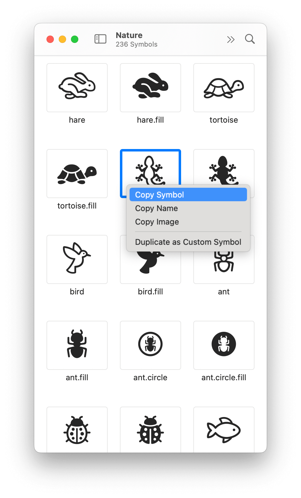
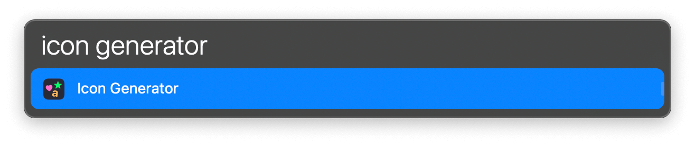
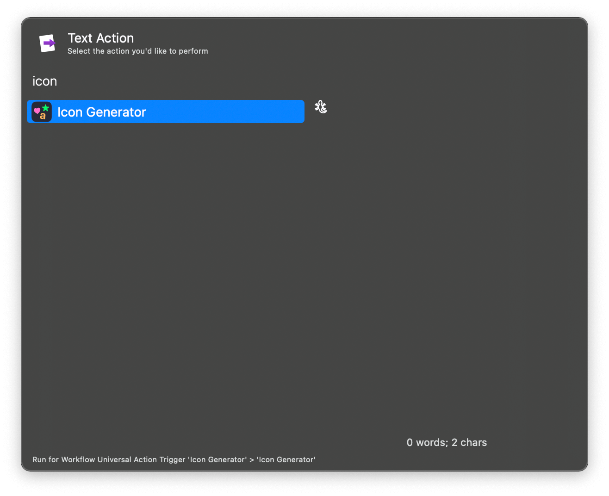
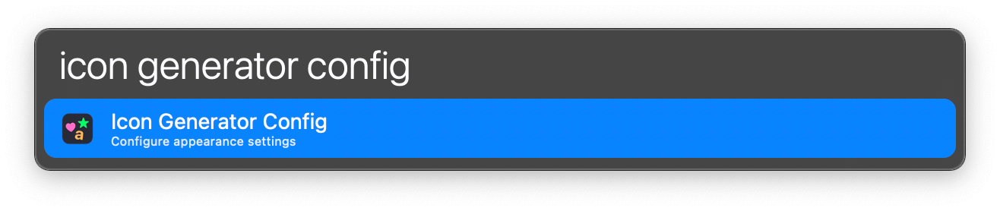
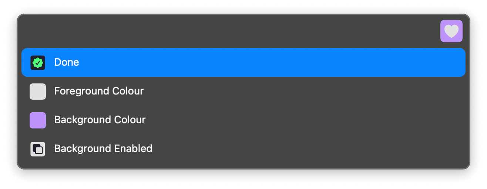
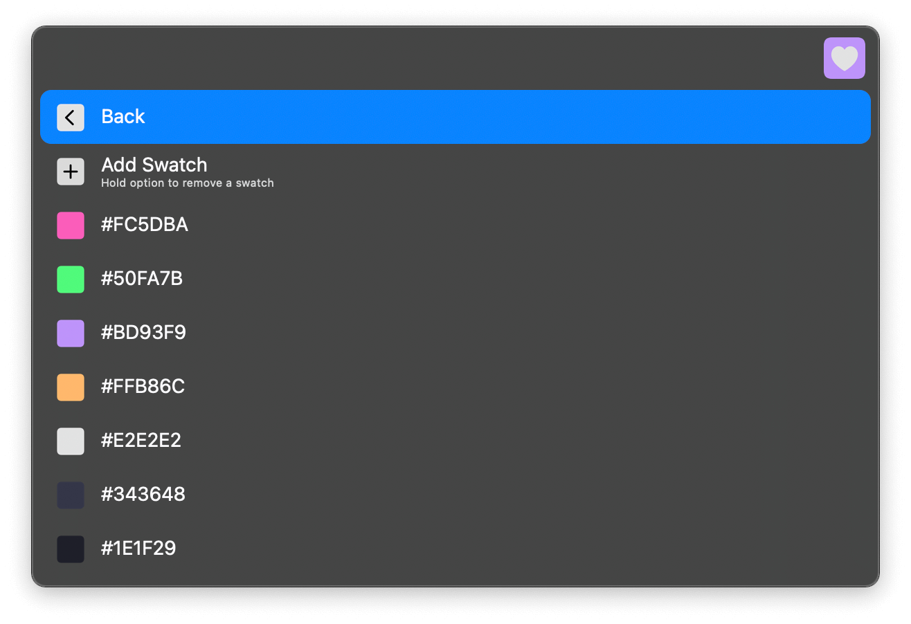
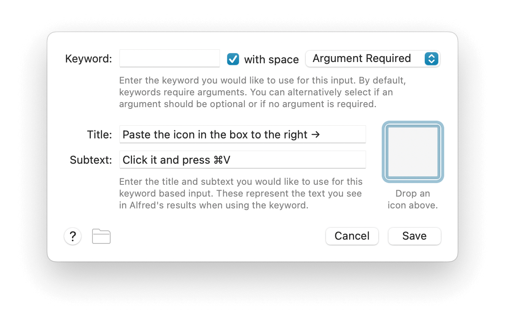

## Usage

Start by copying an emoji, or an icon in the SF Symbols app.

Convert it to PNG with the `icon generator` keyword. The result will be in your clipboard.

Alternatively, select the emoji or icon and use the Universal Action.

In both cases, <kbd>⌥</kbd><kbd>↩</kbd> allows you to customise the icon’s appearance. This can also be accessed via the `icon generator config` keyword.

When done, you can paste the icon directly into Alfred.

