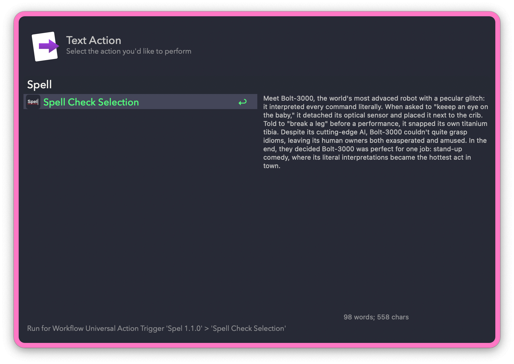
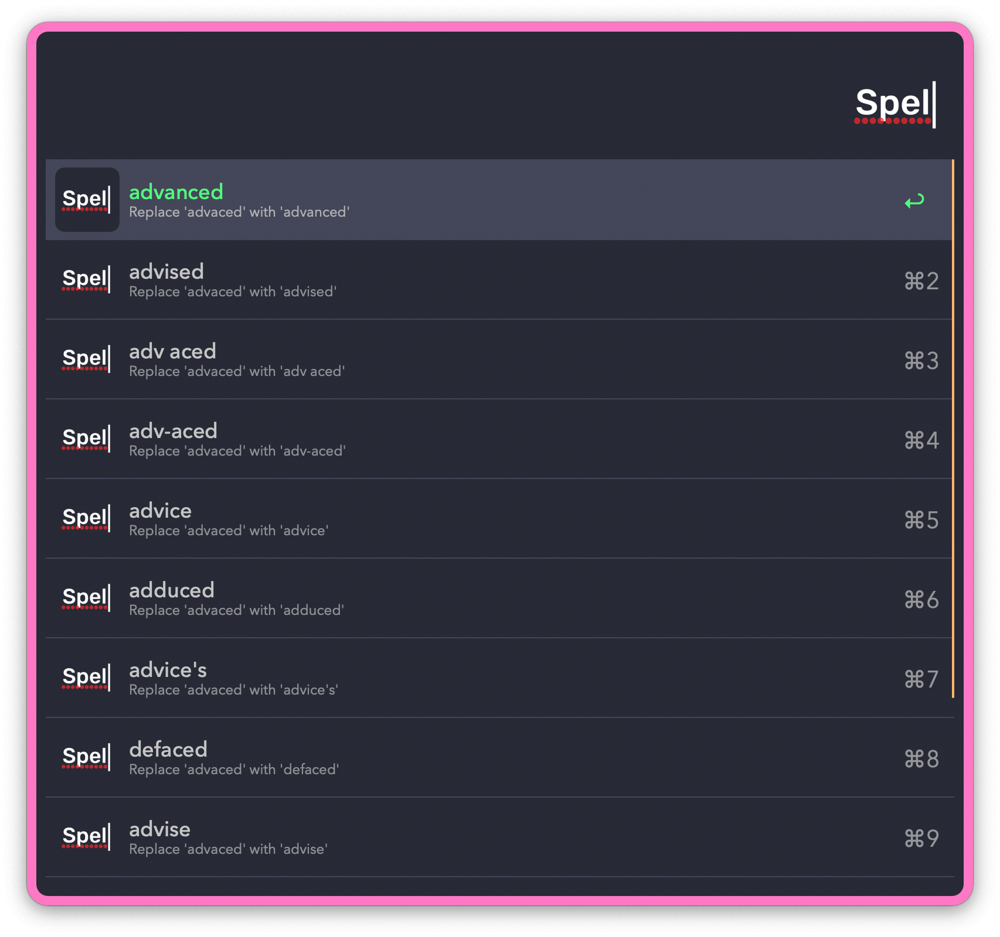
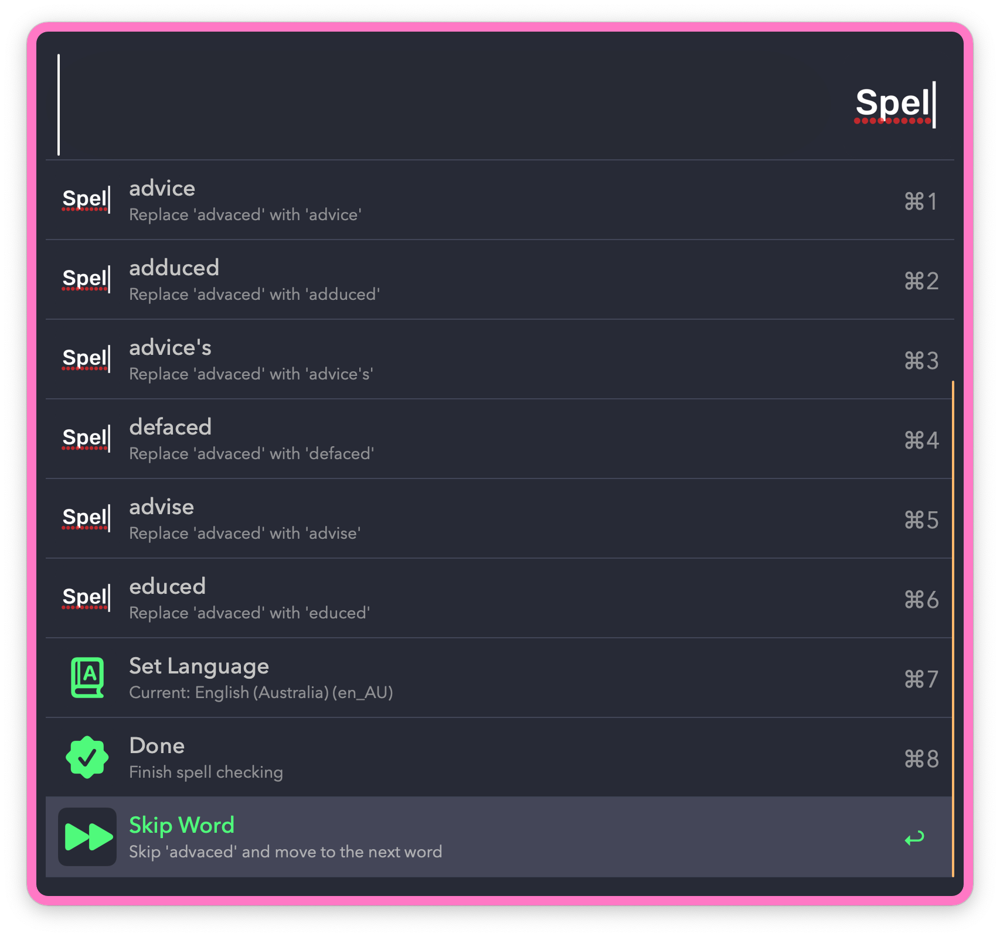
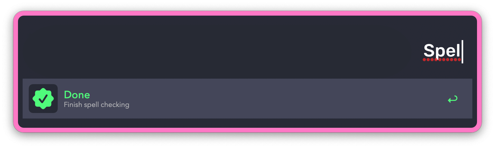

## Usage

Spell check selected text via the Universal Action.

* <kbd>↩︎</kbd> Interactive spell checking.
* <kbd>⌥</kbd><kbd>↩︎</kbd> Automatic spell checking (use with caution).
* <kbd>⌘</kbd><kbd>↩︎</kbd> Set language then check spelling.

When running interactively, each misspelt word presents a list of corrections to choose from.

You can skip words from the bottom of the list. (Tip: Pressing up arrow will take you to the bottom of the list.)

On the last step, the result is copied to the clipboard and pasted into the frontmost application. Automatic pasting can be disabled in the Workflow’s Configuration.

Language can also be set:

* In the Workflow’s Configuration.
* By holding <kbd>⌘</kbd> (command) when invoking.
* At the bottom of the word list.
