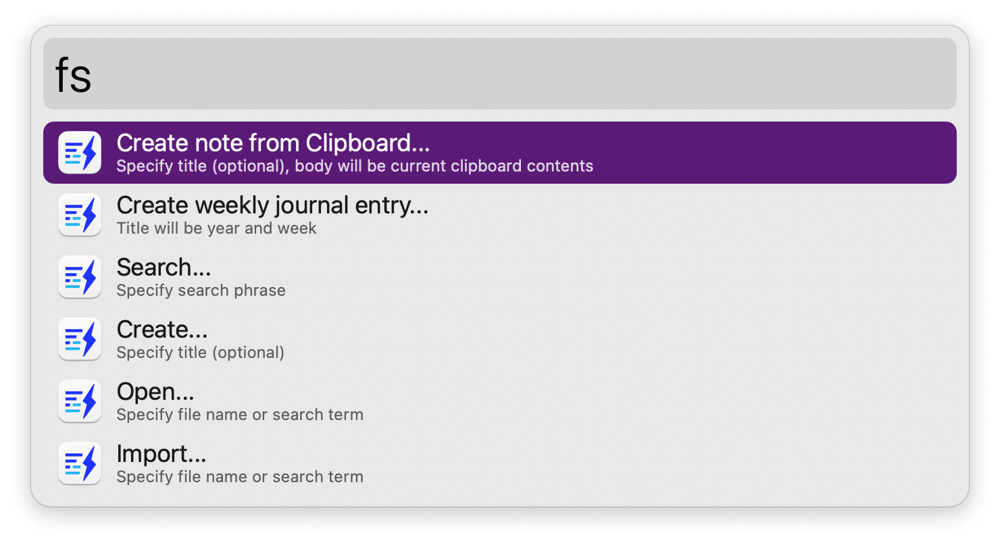
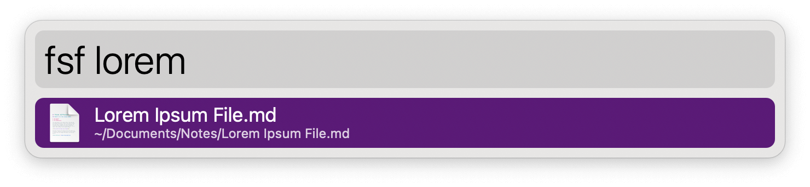
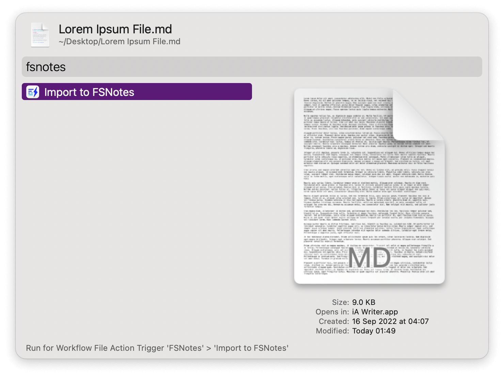
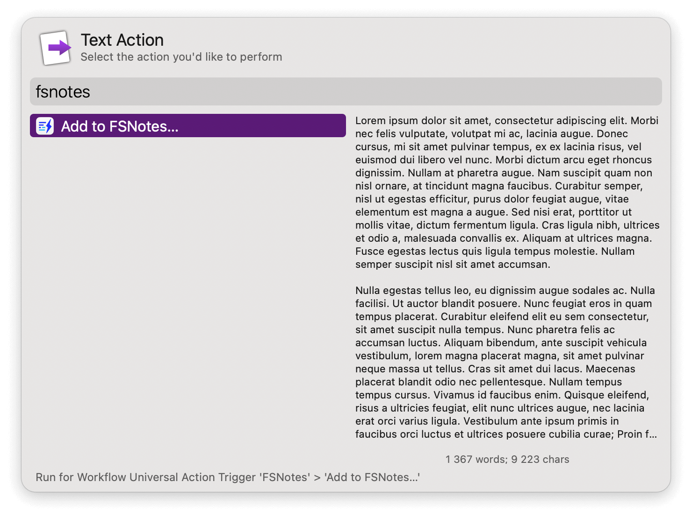

## Usage

Search FSNotes and import new content via the workflow’s keywords:

* `fsf` Search and open notes in Alfred.
* `fss` Search in FSNotes.
* `fsi` Search and import note.
* `fsn` Create new note.
* `fsc` Create new note from clipboard contents.
* `fsj` Create weekly journal entry.

Alternatively import a file, selected text, or an item from Clipboard History via the Universal Actions.

