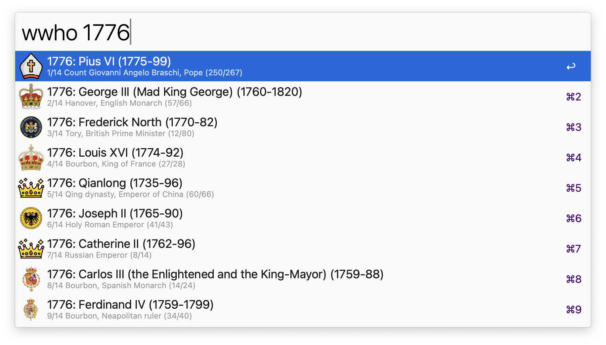
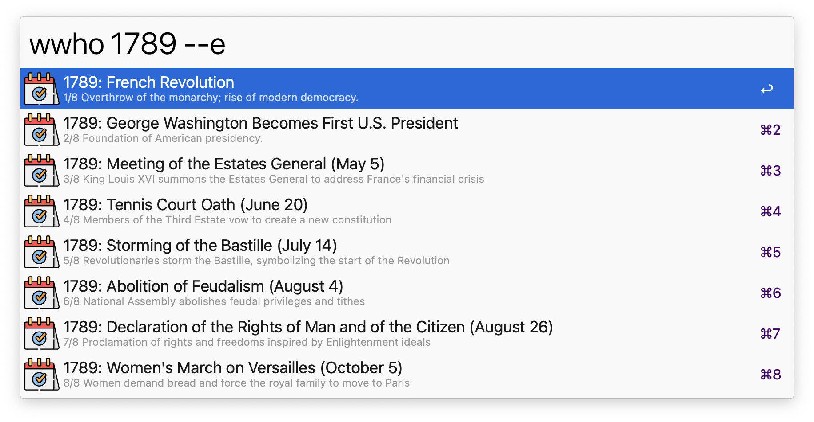
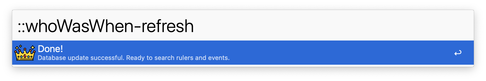

## Usage

Search for historical names, titles, years, or events via the `wwho` keyword.

Filter for events only via the `--e` search flag.

Once a result is identified, it can be actioned in one of five ways:

- <kbd>↩</kbd> Show the Wikipedia page of the ruler (or event, if available).
- <kbd>^</kbd>️️<kbd>↩</kbd> 'Travel' to the first year of the ruling period or event.
- <kbd>⌘</kbd><kbd>↩</kbd> 'Travel' to the last year of the ruling period or event.
- <kbd>⌥</kbd><kbd>↩</kbd> Show the list of rulers with that title (e.g. 'English monarch').
- <kbd>⇧</kbd><kbd>↩</kbd> Copy the info about the ruler or event to the clipboard.

_Note_: <kbd>⌘</kbd><kbd>⌥</kbd><kbd>↩</kbd> return to the main search.

## Update

Refresh the master database at intervals set in the Workflow's configuration, or manually via the `::whoWasWhen-refresh` keyword.

