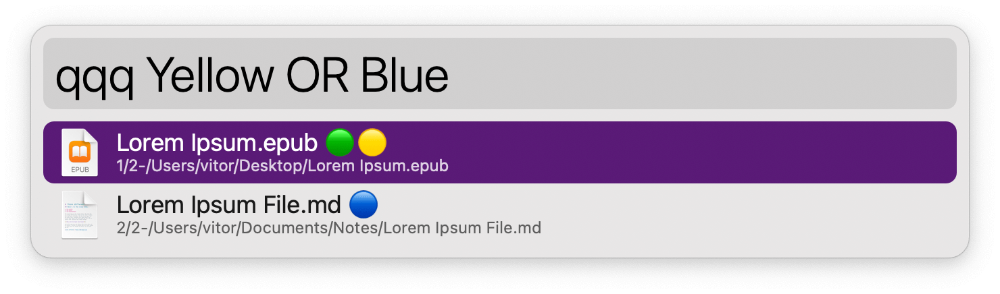
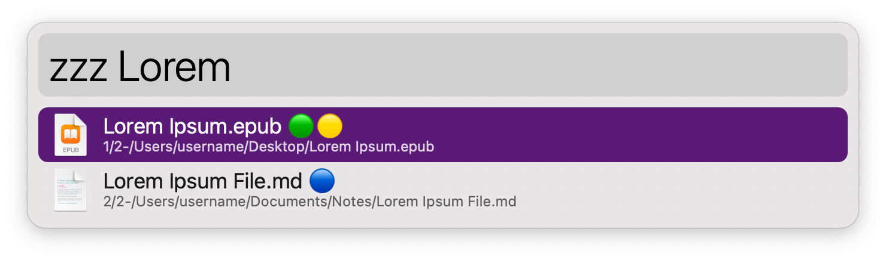

## Usage

Search for file tags via the `qqq` keyword. Searches are case-sensitive and accept boolean operators for further filtering (`AND`, `OR`, `NOT`).

* <kbd>↩</kbd> Open.
* <kbd>⌘</kbd><kbd>↩</kbd> Reveal in Finder.
* <kbd>⌃</kbd><kbd>↩</kbd> Show path in Large Type.

Generic file searches are accessible via the `zzz` keyword.

To view label colours in the results, turn on the option in the Workflow’s Configuration.
