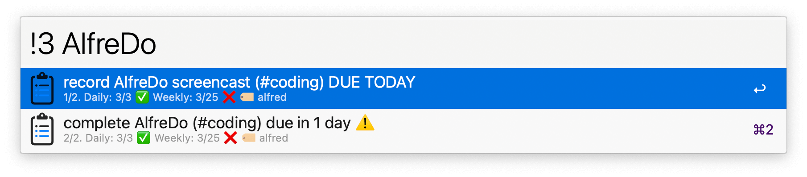
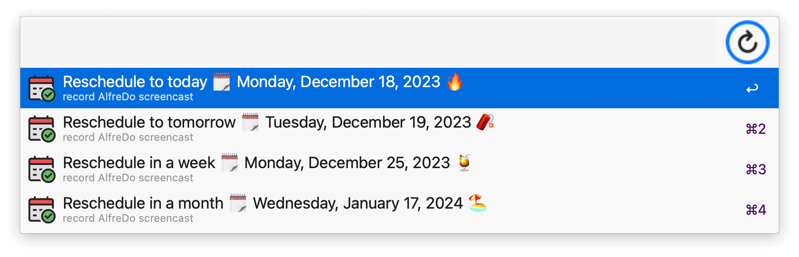
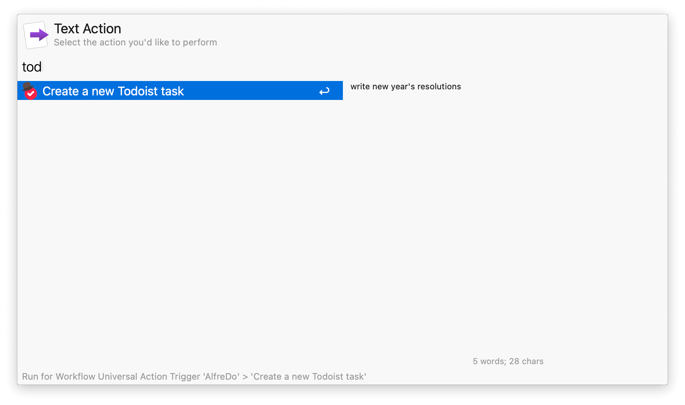

## Usage

List your [Todoist](https://todoist.com/) tasks via the workflow’s keywords:

* `!1` Due today.
* `!2` Overdue.
* `!3` All tasks.

Use multiple strings, or label/projects to refine search. Use `@` to enter one or more labels, `#` to enter a project/section.

* <kbd>↩</kbd> Open task on Todoist’s website or app. Customisable in the Workflow’s Configuration.
* <kbd>⇧</kbd><kbd>↩</kbd> Mark task as complete.
* <kbd>^</kbd><kbd>↩</kbd> Reschedule task.

Create a new task via the `!!!` keyword or the Universal Action.

