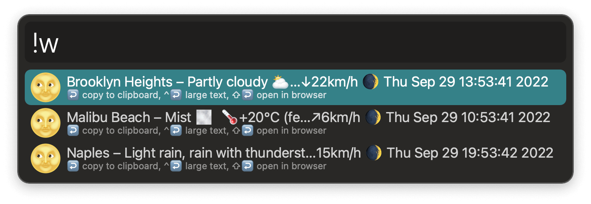

## Usage

Retrieve weather and other almanac information via the `!w` keyword. You can enter a location/ZIP code or set default locations in the Workflow’s Configuration.

* <kbd>↩</kbd> Copy to the clipboard and paste to the frontmost application.
* <kbd>⇧</kbd><kbd>↩</kbd> Open the corresponding page on https://wttr.in.
* <kbd>⌃</kbd><kbd>↩</kbd> Show the almanac string in large font.

### Weather format:

* `%C` Weather condition text.
* `%c` Weather condition.
* `%t` Real temperature.
* `%f` “Feels like” temperature.
* `%h` Humidity.
* `%w` Wind.
* `%m` Moon phase.

The almanac section outputs the local date and time; current week of the year; current quarter; days from and to the end of the year; and days from and to the special day.
