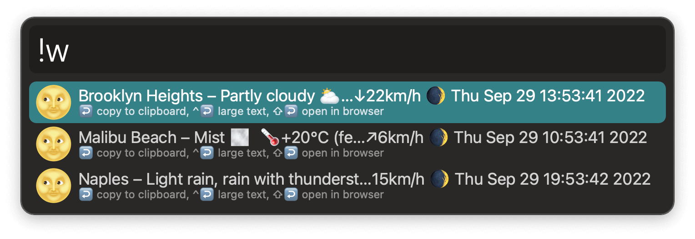

## Usage

Retrieve weather and other almanac information via the `!w` keyword. You can enter a location/ZIP code or set default locations in the Workflow’s Configuration.

* <kbd>↩</kbd> Copy to the clipboard and paste to the frontmost application.
* <kbd>⇧</kbd><kbd>↩</kbd> Open the corresponding page on https://wttr.in, or the city’s OpenWeather page when OpenWeather is the source.
* <kbd>⌃</kbd><kbd>↩</kbd> Show the almanac string in large font.
* <kbd>⌥</kbd> Show the local date, time and timezone.

### Weather source

Weather comes from https://wttr.in by default. Set **Weather Info Source** to OpenWeather to use https://openweathermap.org instead, with your own API key. OpenWeather uses a fixed summary and ignores the format string below. Temperatures can be shown in °F or °C via **Temperature unit**.

### Weather format:

* `%C` Weather condition text.
* `%c` Weather condition.
* `%t` Real temperature.
* `%f` “Feels like” temperature.
* `%h` Humidity.
* `%w` Wind.
* `%m` Moon phase.

The almanac section outputs the local date and time; current week of the year; current quarter; days from and to the end of the year; and days from and to the special day.

### Optional features

These are off by default and can be turned on in the Workflow’s Configuration.

* **Weekly plan:** appends a link to this week’s plan file in a folder of Markdown notes. On Fridays next week’s link is added too, and unchecked tasks are carried over into it. The filename pattern and link style are configurable.
* **Line-a-day lookback:** appends what you wrote on this date in previous years, read from a line-a-day file.
* **Obsidian daily note:** appends the almanac report to today’s daily note instead of pasting it, optionally creating the note if it does not exist.
