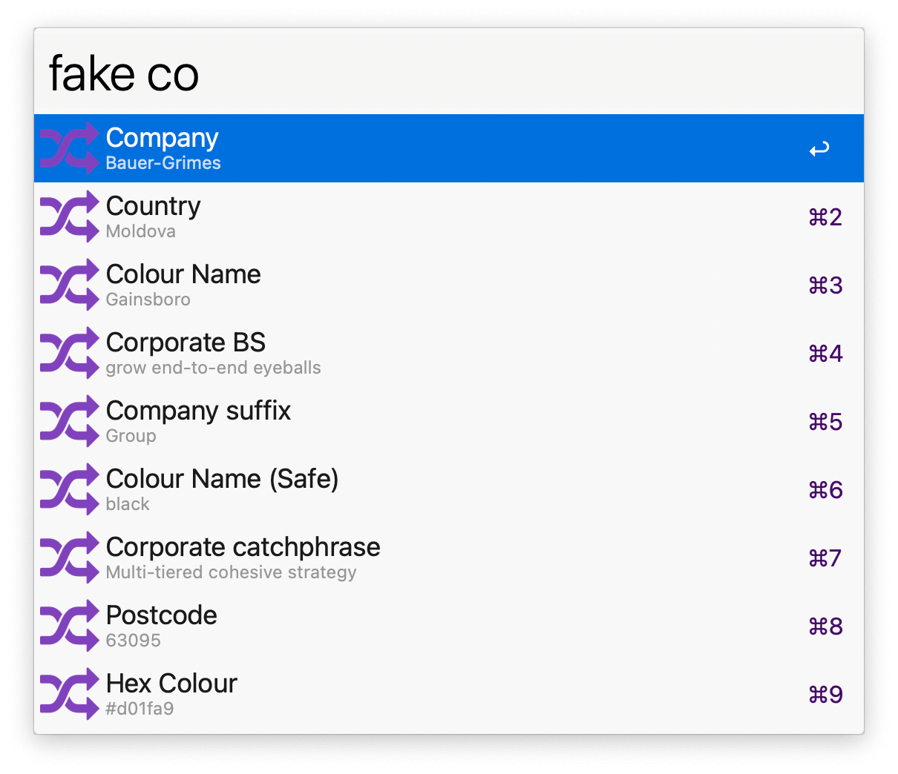
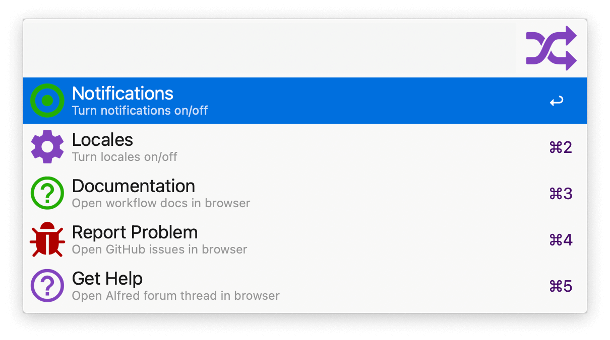

## Usage

Search available fake data types via the `fake` keyword.

* <kbd>↩</kbd> Copy data to clipboard.
* <kbd>⌘</kbd><kbd>↩</kbd> Paste datum to frontmost app.
* <kbd>⇥</kbd> Auto-complete. Add a number to specify how many datasets to copy to clipboard.

Configure the Snippet Trigger for faster triggering.

View documentation and toggle locales with the `fakeconfig` keyword.

---

## Credits

Forked from the original by Dean Jackson.
