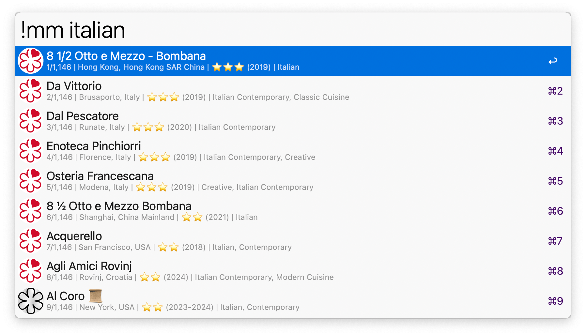
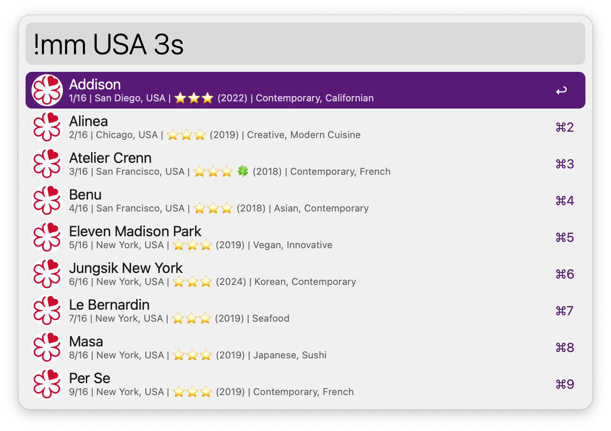
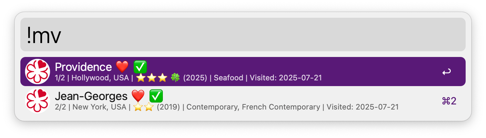
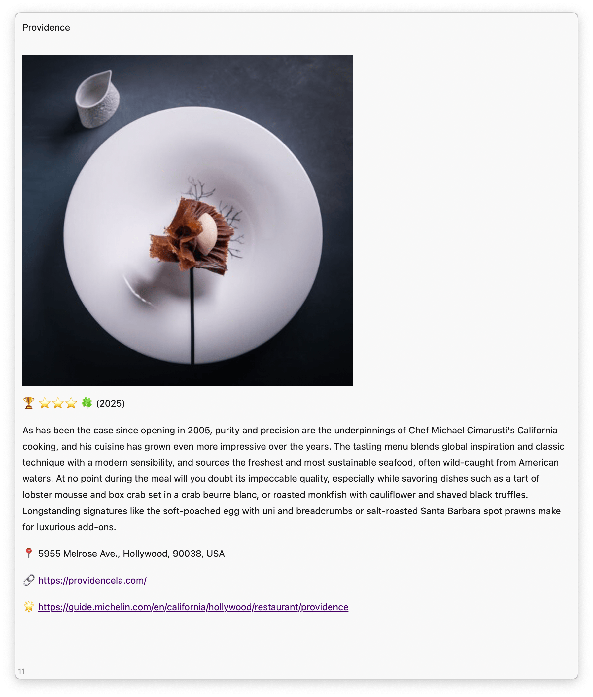

## Usage

Search for Michelin restaurants by name, location, cuisine, or distinction via the `!mm` keyword.

Search is case-sensitive when it includes uppercase letters. Awards can be searched via `3s`, `2s`, `1s`, `bib`, `gs`, or `sr` keywords.

List and search all your favorite and visited restaurants via the `!mf` and `!mv` keywords.

Configure the Hotkey for faster triggering.

## Once a restaurant is identified:

* <kbd>↩</kbd> Open restaurant website according to the preference specified in the Workflow's configuration.
* <kbd>^</kbd><kbd>↩</kbd> Add or remove from favorites.
* <kbd>⌘</kbd><kbd>↩</kbd> View award history.
* <kbd>⌥</kbd><kbd>↩</kbd> Add or remove from visited.
* <kbd>⇧</kbd><kbd>↩︎</kbd> Show more details.

