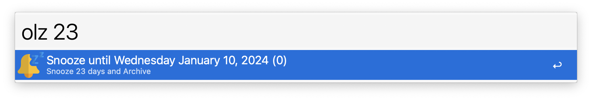
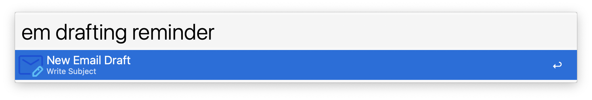
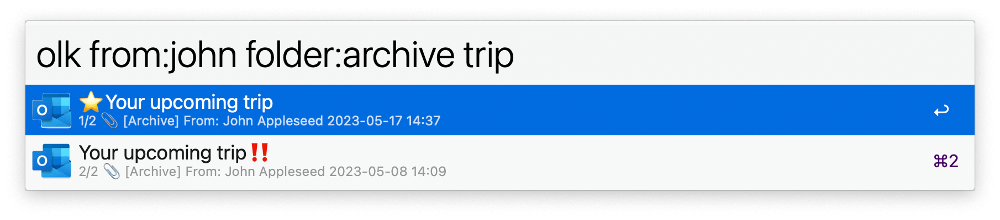

## Usage

Interact with Microsoft Outlook emails via the workflow’s keywords:

* `olk` Search email.
* `ols` Save email.
* `olz` Snooze email.
* `em` Draft email.

* <kbd>↩</kbd> Open email in Outlook.
* <kbd>^</kbd><kbd>↩</kbd> Show all the messages in the thread.
* <kbd>⇧</kbd><kbd>↩</kbd> Show message in Large Type and copy to clipboard.

### Advanced search

Gmail-like search strings are supported. Set the `My Name` field in the Workflow’s Configuration to take full advantage of the feature:

* `from:` (including `from:me`). Replace space with underscore if you want to specify the whole name (e.g. `from:john_appleseed`).
* `to:` (including `to:me`).
* `cc:` (including `cc:me`).
* `subject:`,  `has:attach`, `is:unread`, `is:read`, `is:important`, `is:unimportant`.
* `folder:`. Replace spaces with underscores if the folder name contains spaces, e.g. `folder:sent_items`).
* `-text` to exclude text.
* `account:` to filter by Exchange account.
* `--a` to sort by increasing date (oldest first).
* `since:n` to return email received in the last `n` days. `w` and `m` are supported for months and weeks, respectively (e.g. `since:2w`).
* `sq:` to open a list of saved queries.
