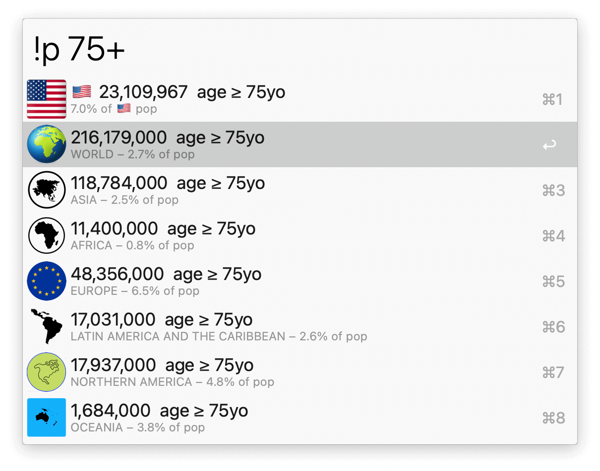
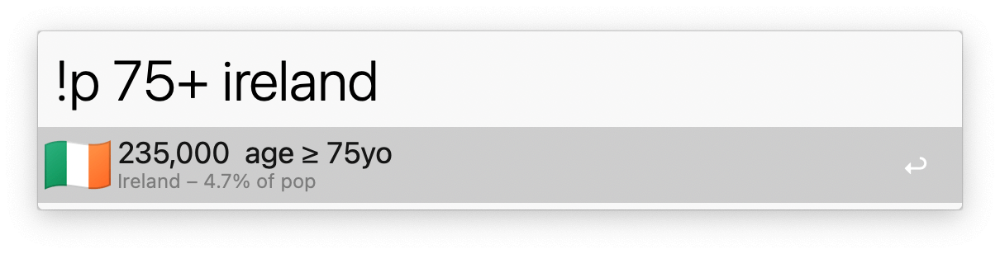
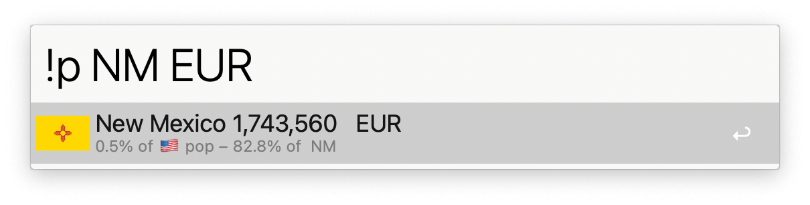

## Usage

List population sizes around the world via the `!p` keyword.

* <kbd>↩</kbd> Copy current row to clipboard.
* <kbd>⌃</kbd><kbd>↩</kbd> Paste current row to frontmost app.
* <kbd>⌘</kbd><kbd>↩</kbd> Paste entire output to frontmost app.

Narrow it down by typing a country name or USA state abbreviation and age bracket. Add a `+` or `-` to respectively consider all ages above and below, or separate two numbers with a `-` for an exact range.

Additional data, such as percentage of population with a certain ancestry, is available for US states.

