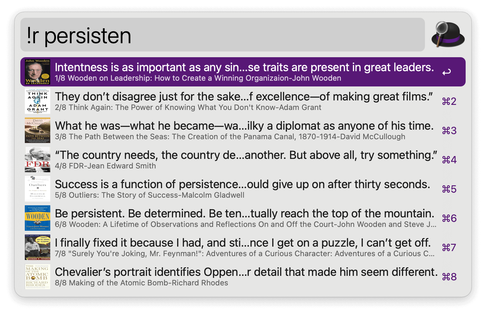
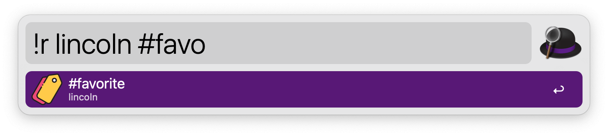
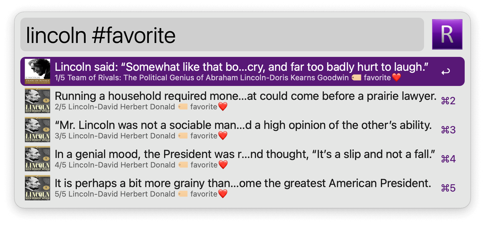
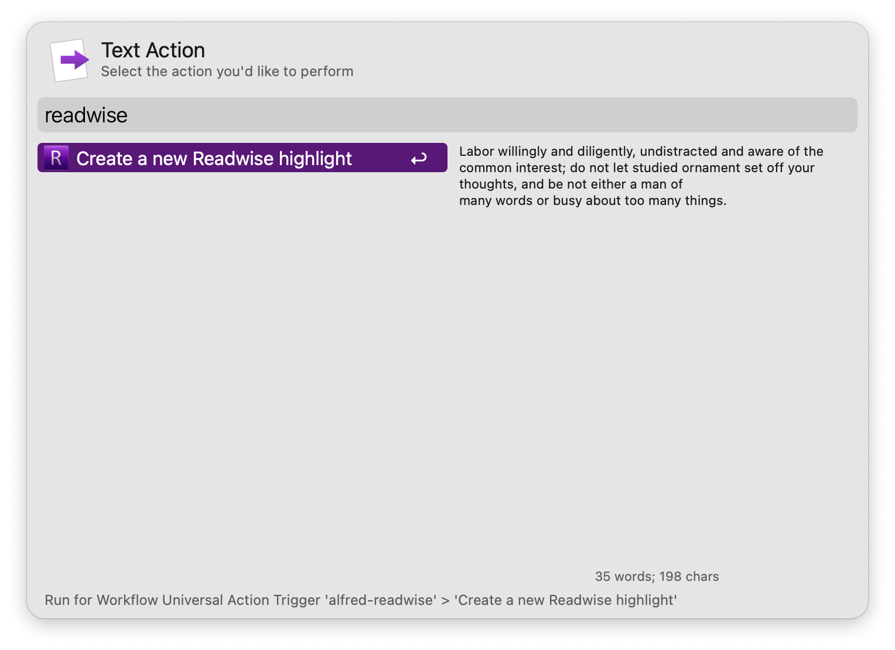

## Usage

List and search your [Readwise](https://readwise.io/) highlights via the `!r` keyword.

`#` prompts a label search which can be added to the standard search.

* <kbd>↩</kbd> Copy highlight and show it in Large Type.
* <kbd>⇧</kbd><kbd>↩</kbd> Copy highlight and show it in Large Type without closing Alfred.
* <kbd>⌘</kbd><kbd>↩</kbd> Open source URL if available (typically for tweets).
* <kbd>^</kbd><kbd>↩</kbd> Open highlight on Readwise.
* <kbd>⇧</kbd><kbd>^</kbd><kbd>↩</kbd> Open all highlights from book on Readwise.
* <kbd>⌘</kbd><kbd>Y</kbd> Quick Look the highlight.

Create new highlights via the Universal Action.

