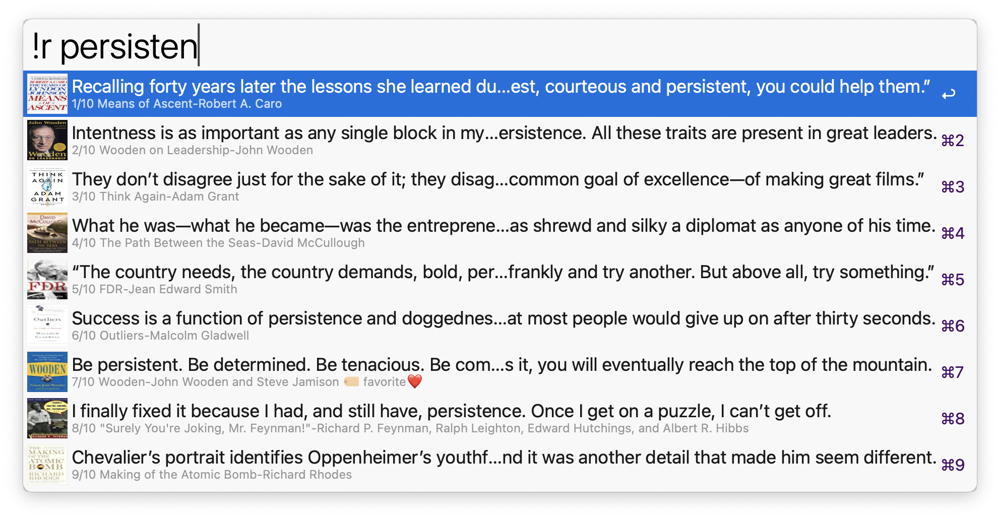
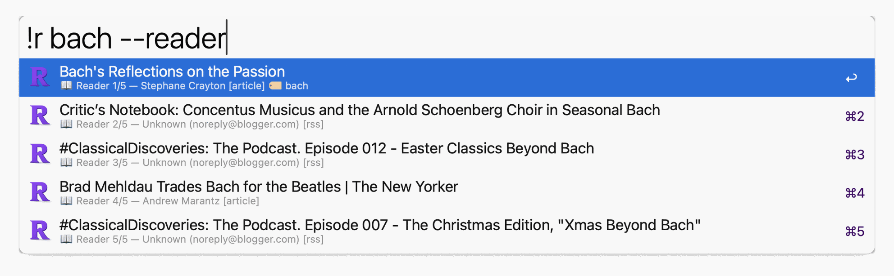
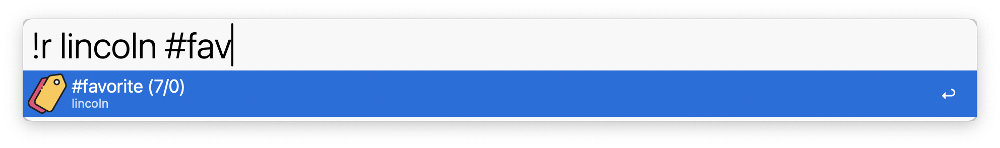
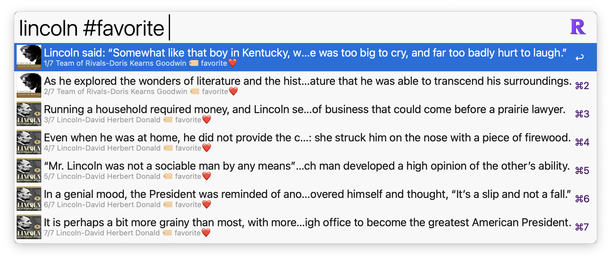
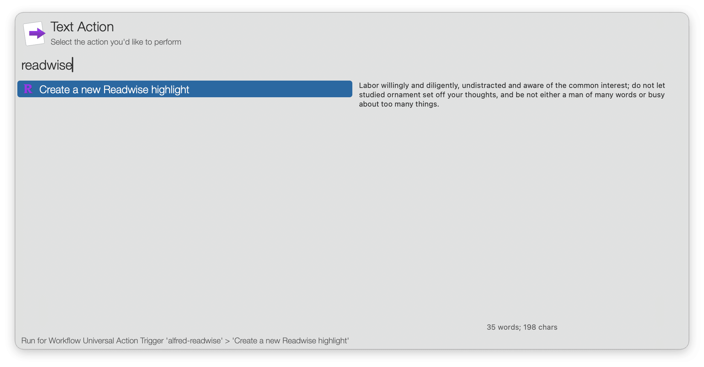

## Usage

List and search your [Readwise](https://readwise.io/) highlights and [Readwise Reader](https://readwise.io/read) documents via the `!r` keyword.

* <kbd>↩</kbd> Copy highlight and show it in Large Type.
* <kbd>⇧</kbd><kbd>↩</kbd> Copy highlight and show it in Large Type without closing Alfred.
* <kbd>⌘</kbd><kbd>↩</kbd> Open source URL if available (typically for tweets).
* <kbd>⌃</kbd><kbd>↩</kbd> Open highlight on Readwise.
* <kbd>⇧</kbd><kbd>⌃</kbd><kbd>↩</kbd> Open all highlights from book on Readwise.
* <kbd>⌘</kbd><kbd>Y</kbd> Quick Look the highlight.

Search highlights, Reader documents, or both, as set in the Workflow’s Configuration. Type `--readwise` or `--reader` anywhere in the query to override it for that search.

* <kbd>↩</kbd> Show title, author, summary, and notes in Large Type.
* <kbd>⌃</kbd><kbd>↩</kbd> Open document in Reader. Opens in the browser or the Reader app, as set in the Workflow’s Configuration.
* <kbd>⌘</kbd><kbd>↩</kbd> Open the original article.

`#` prompts a label search which can be added to the standard search. Labels from both Readwise and Reader are listed, with the number of items each one holds.

Create new highlights via the Universal Action.

Refresh the database at the rate set in the Workflow’s Configuration, or manually via the `readwise:refresh` keyword. Only what changed is synced, making it near-instant. The `readwise:rebuild` keyword downloads everything anew, which is the only way to drop highlights deleted in Readwise.

Configure the Hotkey for faster triggering.
