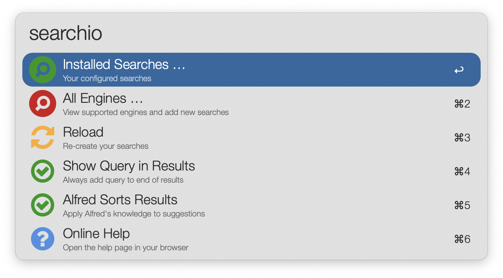
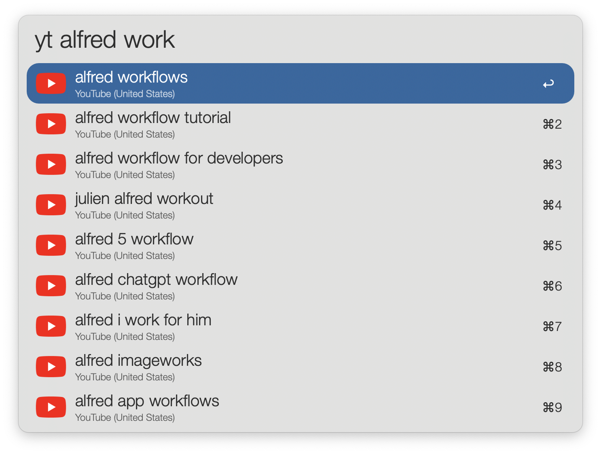
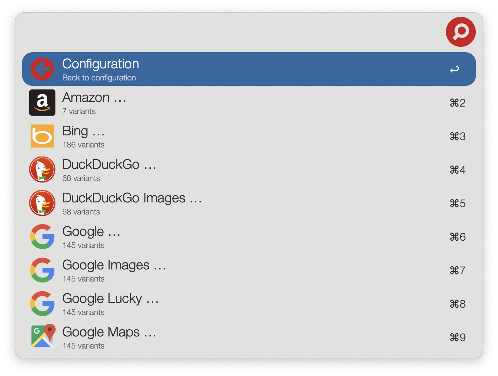

## Usage

Launch the Workflow via the `searchio` keyword. 

There are several example searches pre-configured:

* Search Google in English via the `g` keyword
* Search the English Wikipedia via the `w` keyword
* Search the United States version of YouTube via the `yt` keyword

* Import other available engines by selecting `All Engines …` from the `searchio` menu

## Credits

Forked from the original by Dean Jackson.
