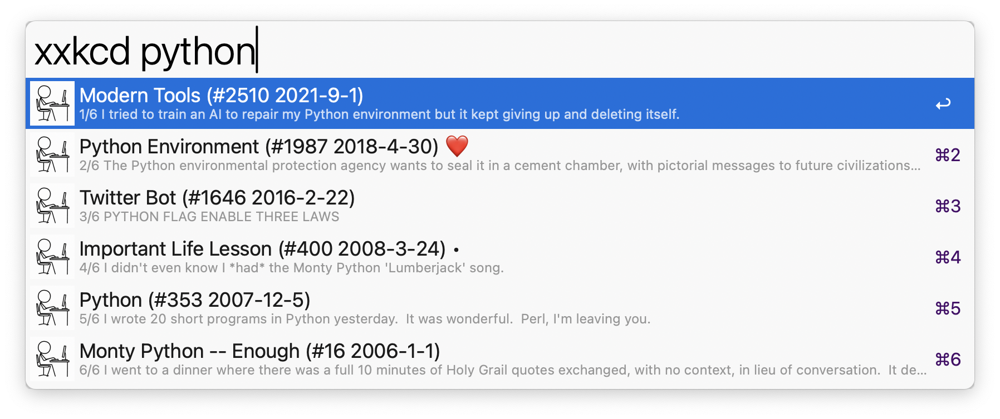

## Usage

- Search (default keyword: `xxkcd`) or hotkey: list and search xkcd comics. `❤️` will denote favorite, `•` unread comics.
- Favorite (default keyword: `xxk::favs`) or hotkey: grid with your favorite xkcd comics.
- Recent (default keyword: `xxk::recent`) or hotkey: grid with recently viewed xkcd comics.
- Random (default keyword: `xxk::random`) or hotkey: one random unread xkcd comic. Press <kbd>enter</kbd> for more!

## On a selected comic:

- <kbd>↩️</kbd> show (comic will be marked as read)
- <kbd>⇧</kbd><kbd>↩️</kbd>: copy comic image to clipboard
- <kbd>⇧</kbd> (QuickLook): QuickLook image (`⇧` or `space` to quit). Using the arrow keys you can quickly review multiple comics (will not be marked as read)
- <kbd>^</kbd><kbd>↩️</kbd>: add or remove from favorites
- <kbd>⌘</kbd><kbd>↩️</kbd>: open on `xkcd.com`
- <kbd>⌥</kbd><kbd>↩️</kbd>: open on `explainxkcd.com` (which has also larger images)

## Updating

- `alfred-xkcd` will download the titles of new comics based on the number of days specified in the `Workflow Configuration` (Refresh Rate variable)
- refresh can be forced with `xxk::refresh`
