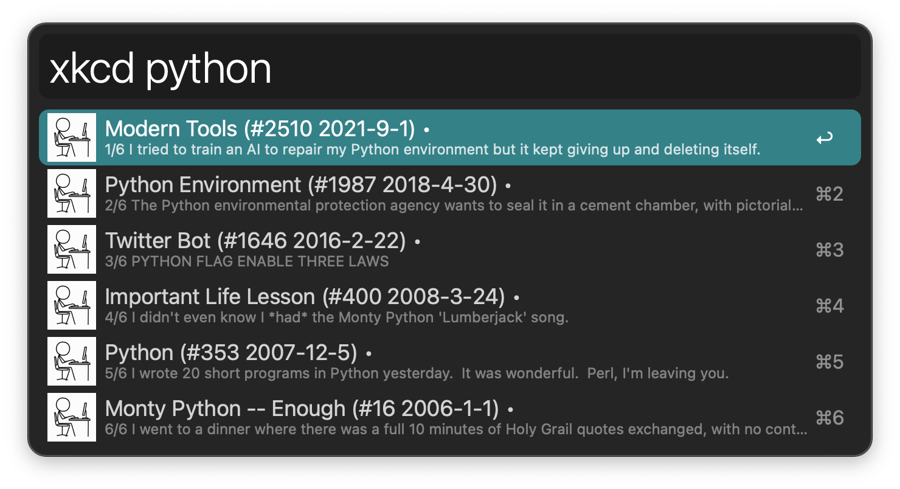
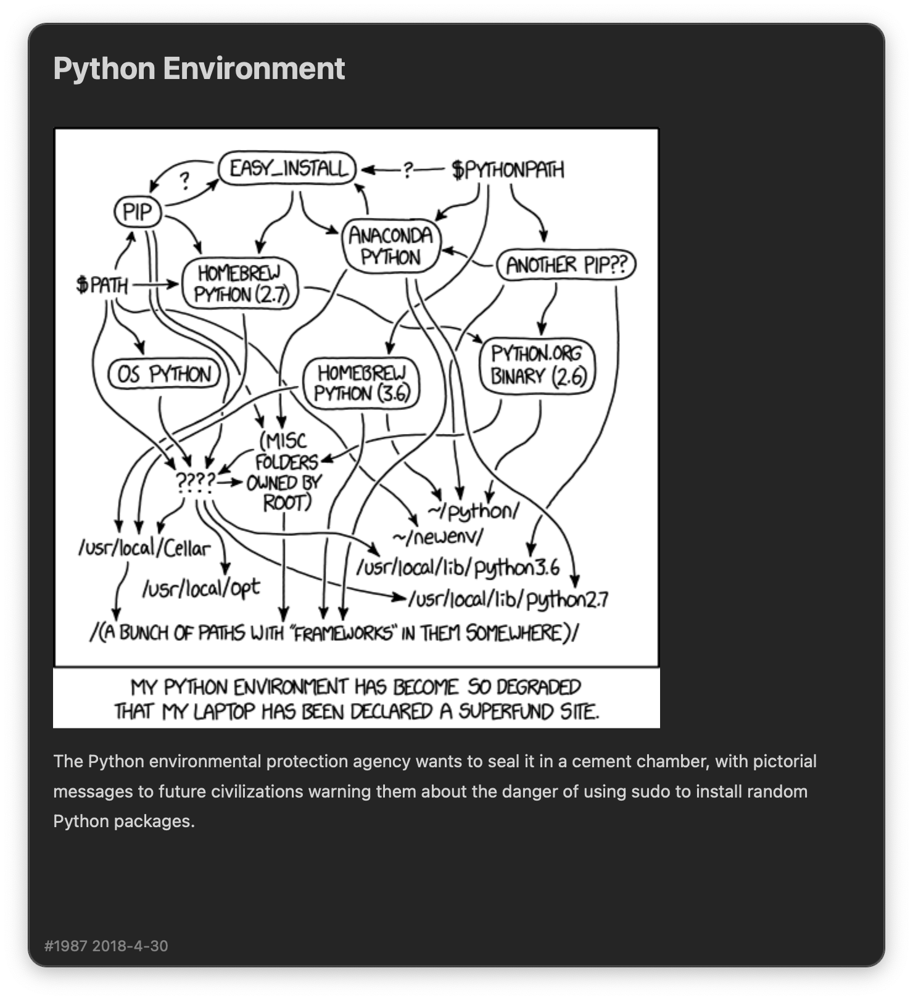
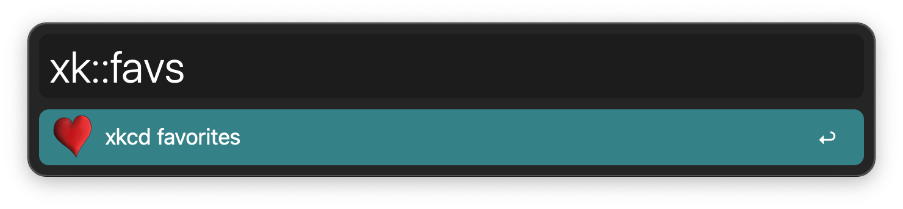
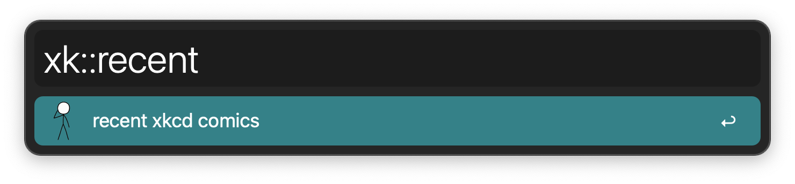
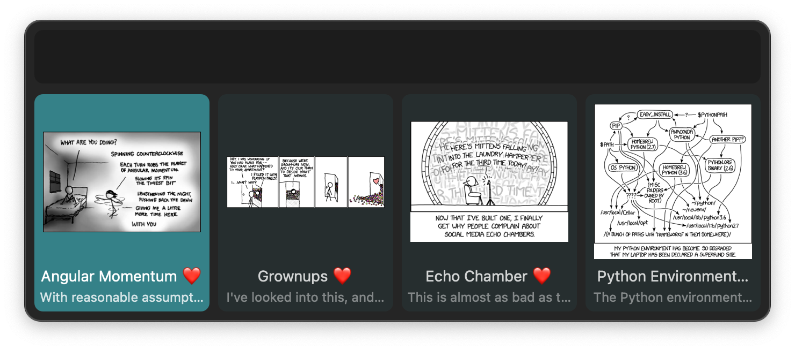
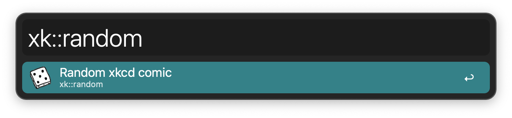
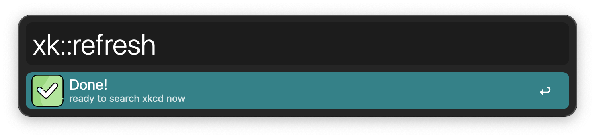

## Usage

List and search [xkcd](https://xkcd.com/) comics via the `xkcd` keyword. `❤️` denotes favorite and `•` unread comics.

* <kbd>↩</kbd> View comic in Alfred and mark as read.
* <kbd>⌘</kbd><kbd>↩</kbd> Open on xkcd website.
* <kbd>⌥</kbd><kbd>↩</kbd> Open on [Explain xkcd](https://www.explainxkcd.com/).
* <kbd>⇧</kbd><kbd>↩</kbd> Copy image to clipboard.
* <kbd>⌃</kbd><kbd>↩</kbd> Add or remove from favorites.
* <kbd>⌘</kbd><kbd>Y</kbd> Quick Look comic.

Review your favourites and recents with the `xk::favs` and `xk::recent` keywords.

View a random comic via the `xk::random` keyword.

The workflow downloads titles of new comics based on the number of days specified in the Workflow’s Configuration. For a with the `xk::refresh` keyword.

