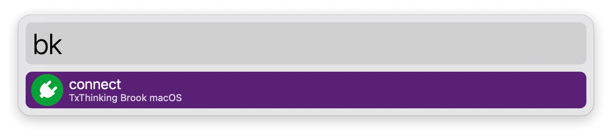
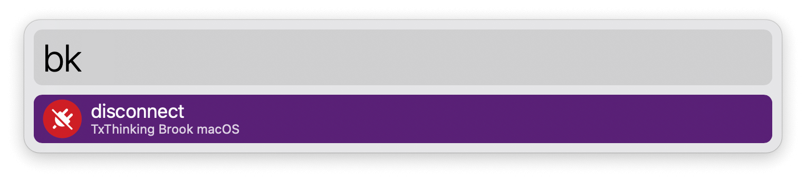

## Setup

Create a Brook VPN configuration with the macOS app.

## Usage

List your Brook VPN configurations via the `bk` keyword. Press <kbd>↩</kbd> to toggle the connection.

Configure the Hotkey for faster triggering.
