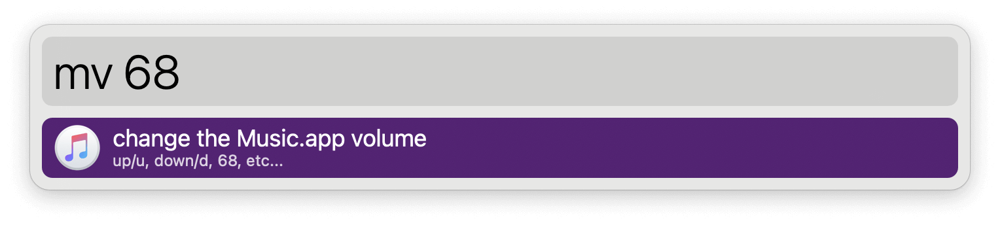

## Usage

Change the volume of the Music app with precision via the `mv` keyword followed by a number. Instead of an exact value you can use `up` / `u` or `down` / `d`.

If called without a value, a notification shows the current volume.

