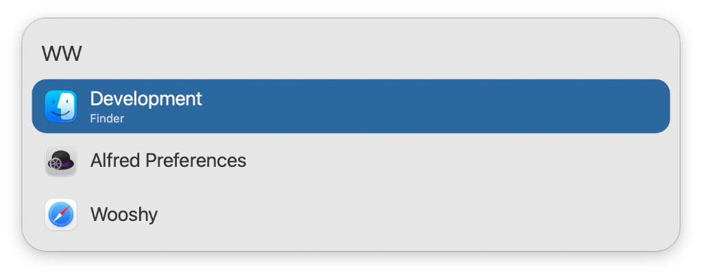
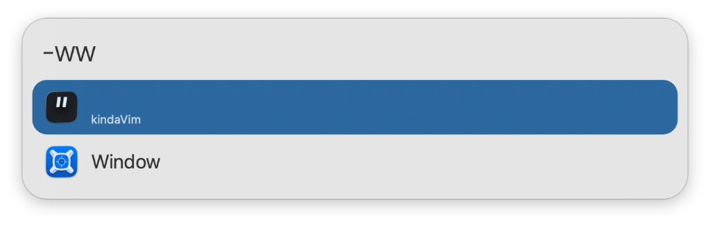

## Usage

List currently visible macOS Windows, sorted from front to back, via the `ww` keyword.

* <kbd>↩</kbd> Bring window to the foreground.
* <kbd>⌘</kbd><kbd>↩</kbd> Exclude window from results.

View excluded windows with the `-ww` keyword.

* <kbd>↩</kbd> Include window in results.

Configure the Hotkeys for faster triggering.
