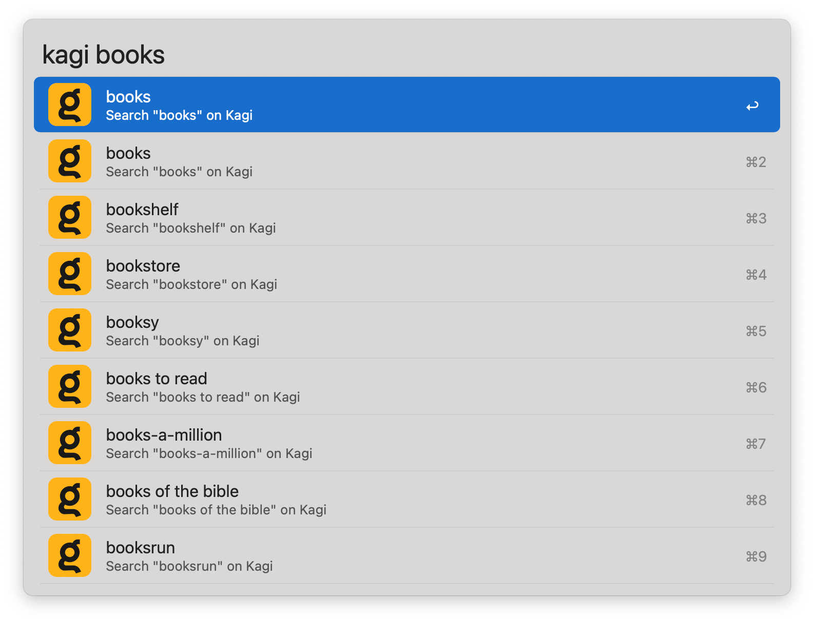

## Setup

Kagi normally requires you to be logged-in to search, but you can *optionally* search using a session key: A special token that is added to the search URL, associating it with your subscription. This allows to perform searches without logging in, which is especially useful for private browsing sessions.

To add your session Key:

1. Create a [Kagi](https://kagi.com/) account and [log in](https://kagi.com/signin).
2. Click the hamburger menu in the upper-right corner.
3. Where it says `Session Link` click the `Copy` button.
4. You will have a URL in this format: `https://kagi.com/search?token=<key>`. Take everything after `token=` and paste it into the `Session Key` field in the Workflow’s Configuration.

## Usage

Search [Kagi](https://kagi.com) with inline search suggestions via the `kagi` keyword.

* <kbd>↩</kbd> Open search results page in the default web browser.
