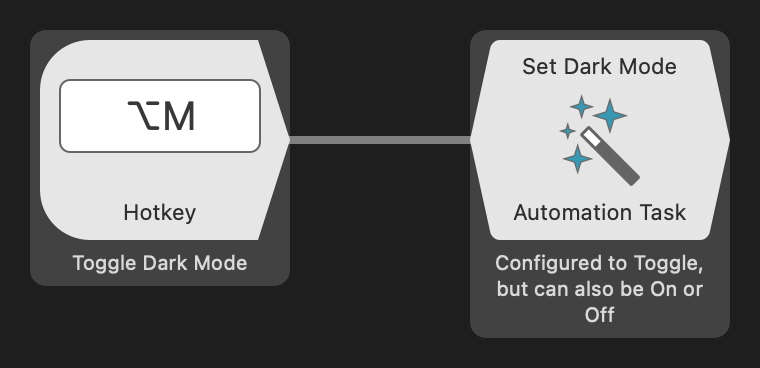
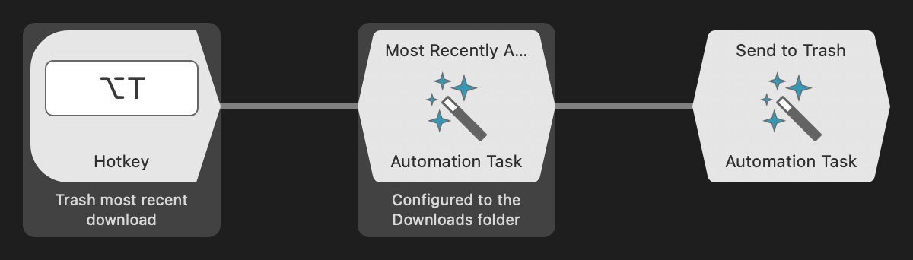
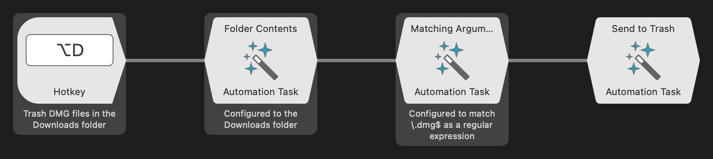
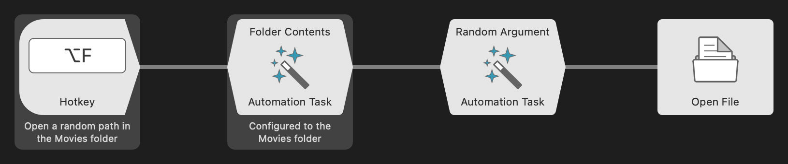

Automation Tasks are built for interoperability within themselves and other Alfred objects. Chain them to manipulate and filter inputs and produce new outputs that can be fed to other objects, or let them stand on their own for single tasks such as converting image formats, copying files, merging PDFs, and taking screenshots.

This workflow provides simple examples to get you started. All of them begin with a Hotkey Trigger.

Some objects are useful on their own, like `Set Dark Mode`:

But Automation Tasks shine when they’re chained. A `Most Recently Added Path` of the Downloads folder connected to a `Send to Trash` deletes your most recent download:

We can do better. How about getting rid of all those downloaded DMGs you’ve accumulated?

* `Folder Contents` set to list contents of the Downloads folder.
* `Matching Arguments` set to match files ending in `.dmg`.
* Trash them.

Automation Tasks interact with other Alfred objects too. Let’s play a random movie:

* `Folder Contents` set to list contents of the Movies folder.
* `Random Argument` to pick one entry at chance.
* ‌`Open File Action` to play it.

You're not limited to interacting with files. Automation Tasks can change your wallpaper, manipulate text and URLs, resize windows, interact with apps, and more! The list keeps growing.
