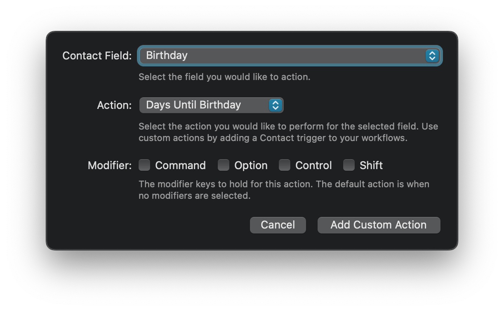
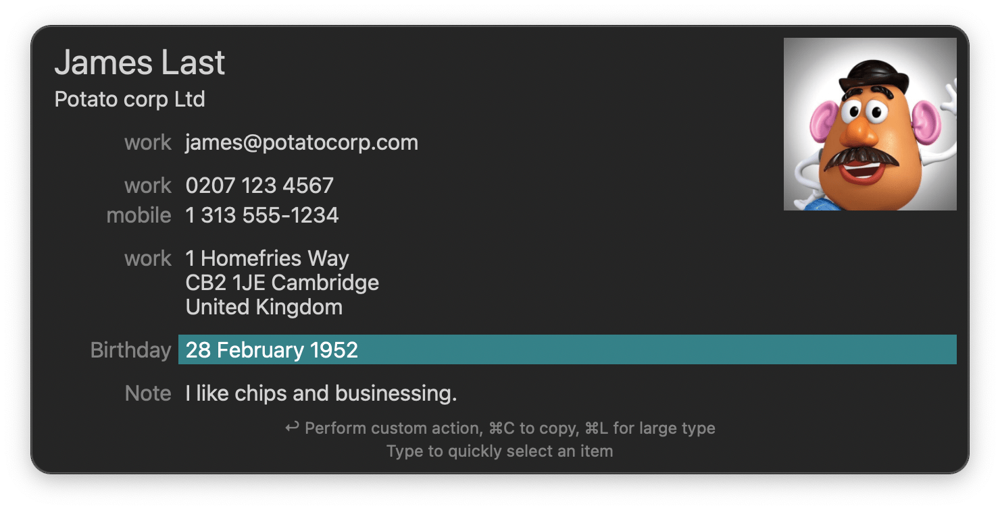

## Setup

Navigate to Alfred Preferences → Features → Contacts. Click the `+` in `Custom Actions`. Set `Contact Field` to `Birthday` and `Action` to `Days Until Birthday`.

## Usage

When viewing a contact in Alfred, highlight the birthday field and press <kbd>↩</kbd> (with or without a modifier, depending on how you configured it in Features). A notification will show the number of days remaining.

