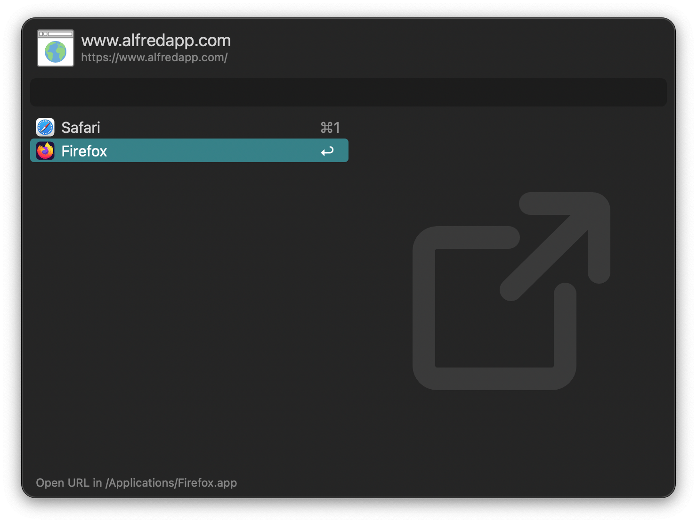

## Usage

Configure the Hotkey to set the shortcut to grab the URL from the frontmost tab in the frontmost web browser and show alternatives in the Universal Actions window.

* <kbd>↩</kbd> Open URL in chosed web browser.
