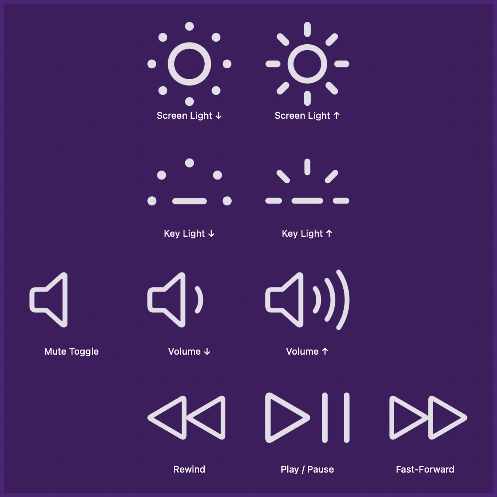

## Setup

Navigate to Alfred Preferences → Remote. Click the `+` to add the full page of shortcuts or add the ones you need to pages you have already created.

## Usage

Simulate pressing different top-row keyboard keys from [Alfred Remote](https://www.alfredapp.com/remote/).

