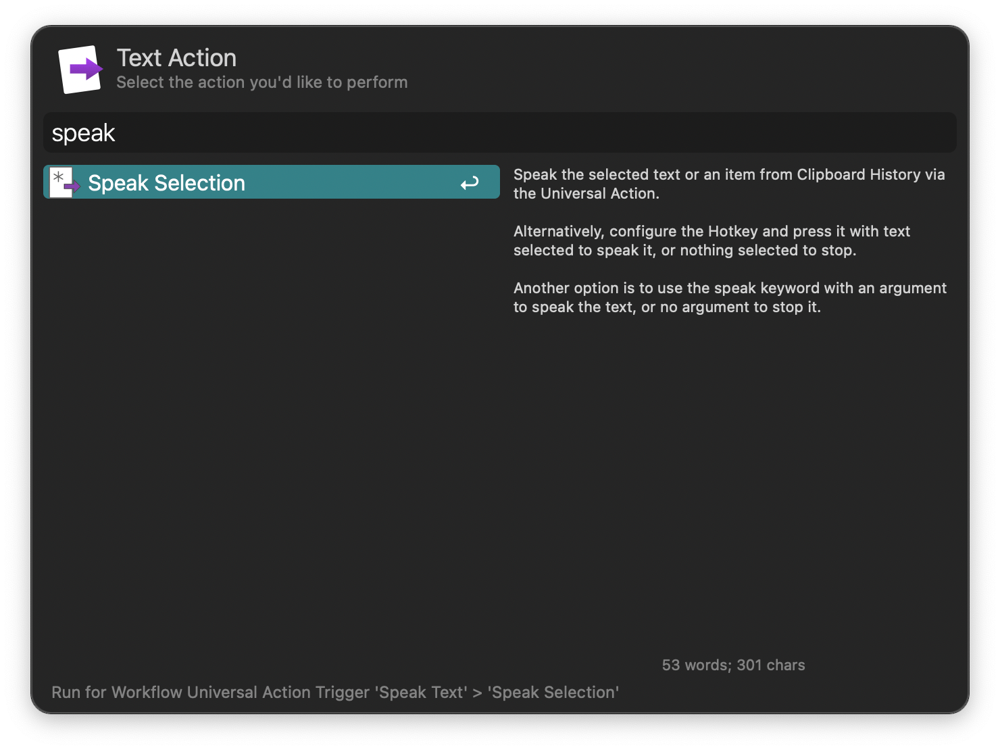
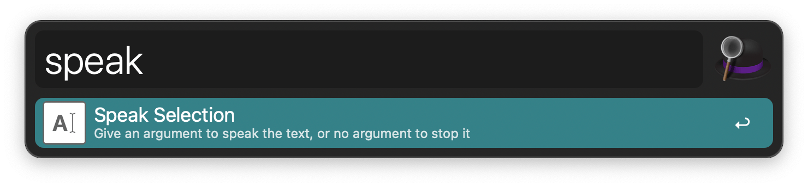

## Usage

Speak the selected text or an item from Clipboard History via the Universal Action.

Alternatively, configure the Hotkey and press it with text selected to speak it, or nothing selected to stop.

Another option is to use the `speak` keyword with an argument to speak the text, or no argument to stop it.

