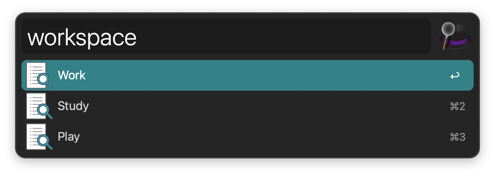

## Setup

1. Edit the List Filter Input to define the workspaces you wish to use.
2. Edit the Conditional Utility to be in sync with the arguments in the List Filter Input.
3. Edit the Launch Apps and Files Action to the apps you want to use in the workspace.

When adding or removing new items on the Conditional Utility, you’ll need to create new Launch Apps and Files Actions too and connect to those.

## Usage

View configured workspaces via the `workspace` keyword.

* <kbd>↩</kbd> Trigger workspace. All apps will quit and the ones you configured for the workspace will open.
