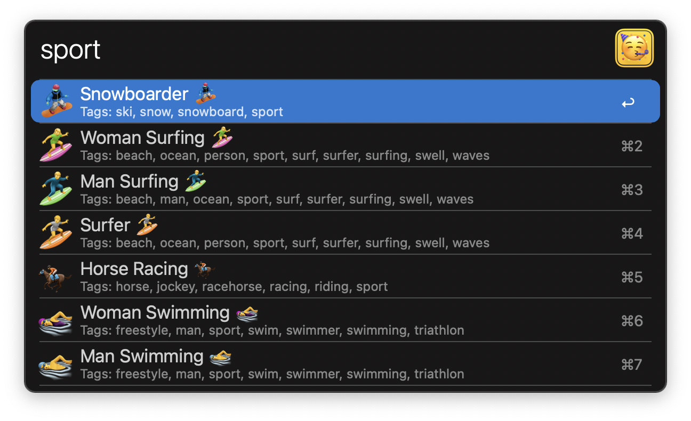

## Usage

Search for emojis via the `emoji` keyword.

* <kbd>↩</kbd> Paste the emoji to the frontmost app.
* <kbd>⌘</kbd><kbd>C</kbd> Copy the emoji to the clipboard.

Select between `List View` or `Grid View` in the Workflow’s Configuration.

Configure the Hotkey for faster triggering.
