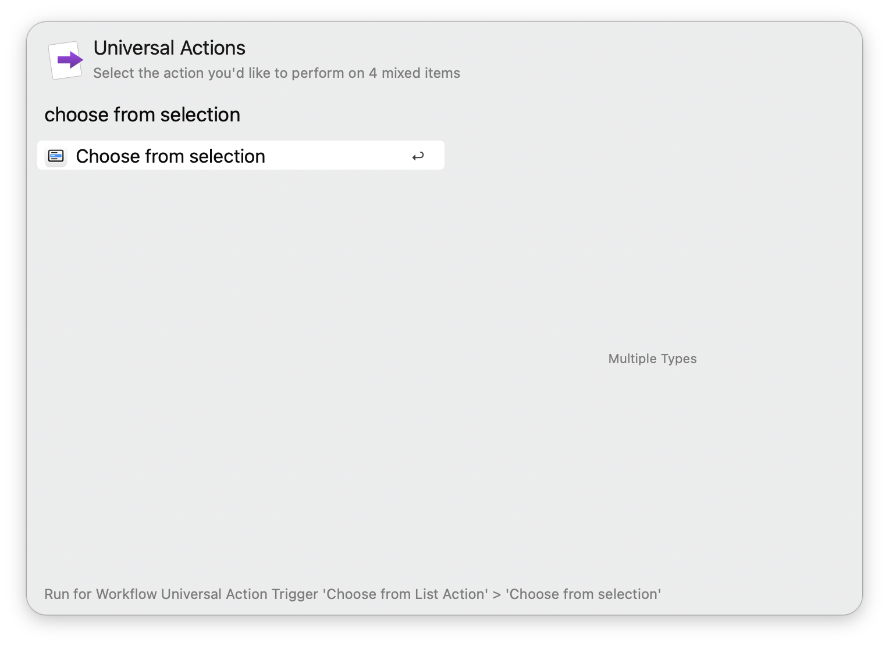

## Usage

Narrow down your selection from multiple action items via the Universal Action.

* <kbd>↩</kbd> Choose current item.
* <kbd>⌘</kbd><kbd>↩</kbd> Remove current item (choose everything else).
* <kbd>⌥</kbd><kbd>↩</kbd> Choose as url with HTTPS (only available if url is detected).
* <kbd>⇧</kbd><kbd>⌥</kbd><kbd>↩</kbd> Choose as url with HTTP (only available if url is detected).
