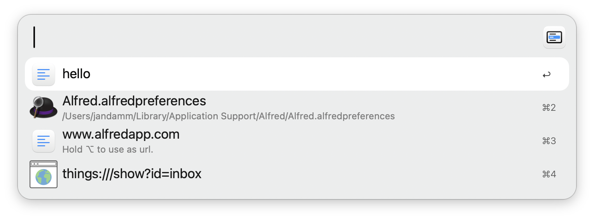

## Usage

Choose from multiple items in the Universal Action.

* <kbd>↩</kbd> Choose current file
* <kbd>⌘</kbd><kbd>↩</kbd> Remove current item (choose everything else)
* <kbd>⌥</kbd><kbd>↩</kbd> Choose as url with https (only available if url is detected)
* <kbd>⇧</kbd><kbd>⌥</kbd><kbd>↩</kbd> Choose as url with http (only available if url is detected)
