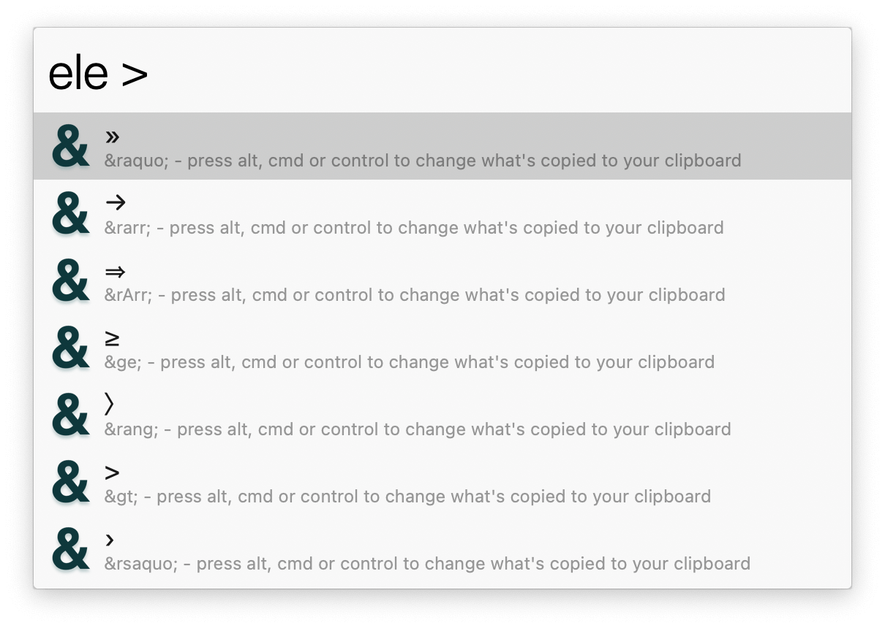

## Usage

Search for HTML entities via the `ele` keyword.

* <kbd>↩</kbd> Copy HTML entity.
* <kbd>⌘</kbd><kbd>↩</kbd> Copy decimal entity.
* <kbd>⌥</kbd><kbd>↩</kbd> Copy character.
* <kbd>⌃</kbd><kbd>↩</kbd> Copy CSS entity.
