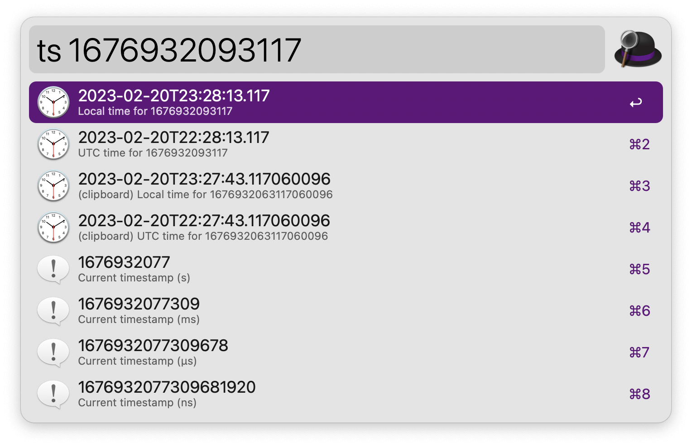

## Usage

Display the current [epoch timestamp](https://en.wikipedia.org/wiki/Unix_time) with different levels of precision via the `ts` keyword. Add a timestamp to convert it to human-readable formats. <kbd>↩</kbd> to copy to the clipboard.

