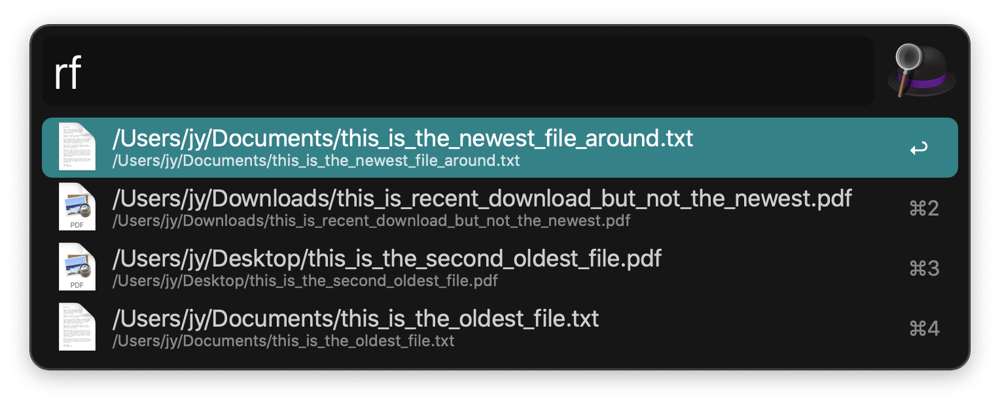

## Usage

List your most recently created or modified files via the `rf` keyword.

* <kbd>↩</kbd> Open file.
* <kbd>⌘</kbd><kbd>↩</kbd> Reveal in Finder.
* <kbd>⌥</kbd><kbd>↩</kbd> Browse in terminal.
* <kbd>⌃</kbd><kbd>↩</kbd> Open with…

Your home folder is searched by default. You can narrow it down or tweak the type and amount of results in the Workflow’s Configuration.
