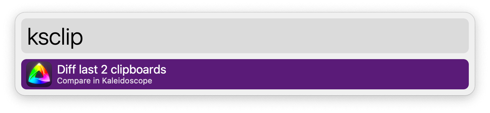
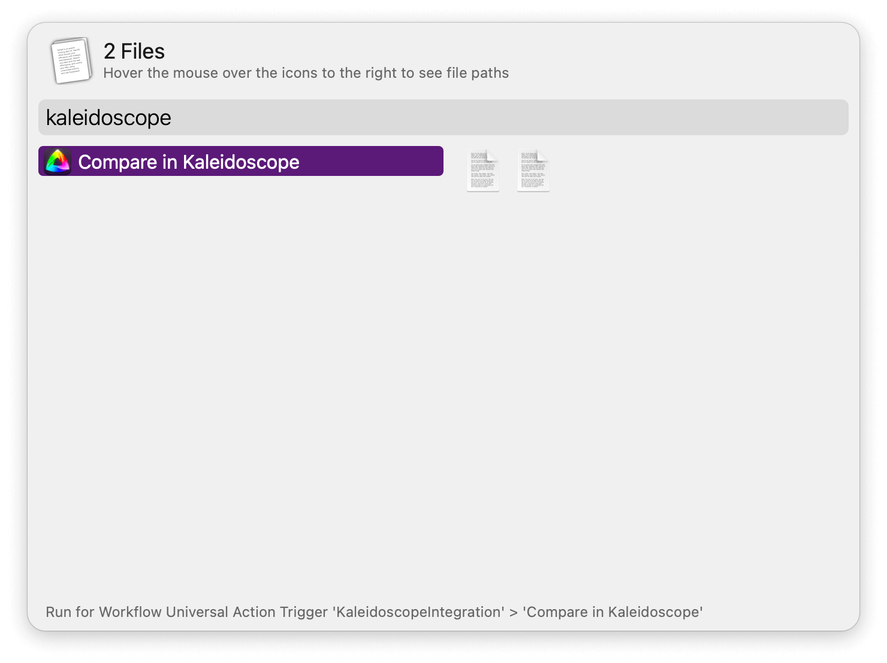

## Setup

Install the workflow from the Kaleidoscope app.

In the menubar: `Kaleidoscope` → `Integration…` → `Alfred`

## Usage

Compare the last two clipboard entries in Kaleidoscope via the `ksclip` keyword.

Compare files via the Universal Action or configure the Hotkey to diff files selected in the Finder.

For files in the File Buffer, use the configurable Hotkey or the `kscomp` keyword.

