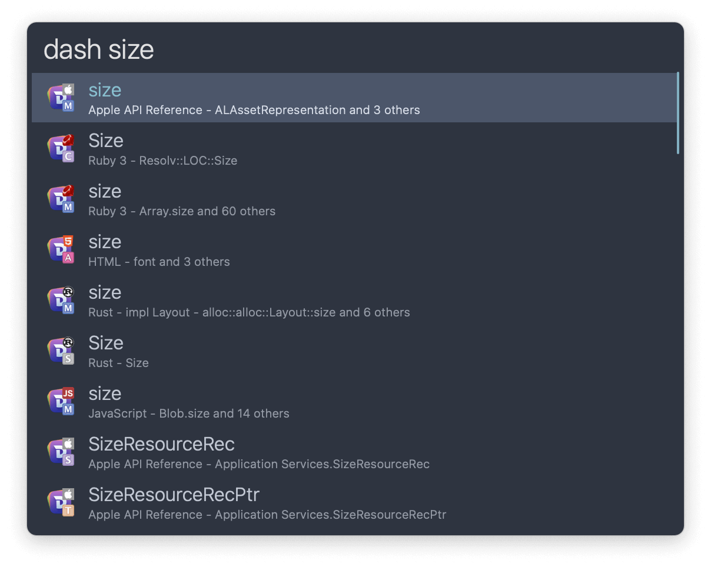
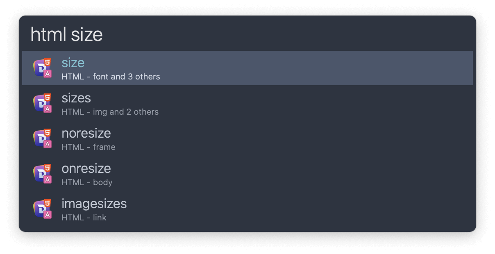

## Setup

Install the workflow from the Dash app.

In the menubar: `Dash` → `Settings…` → `Integration` → `Alfred`.

## Usage

Search documentation in all installed docsets via the `dash` keyword.

Alternatively, use the docsets’ own keyword. Edit them in Dash’s `Preferences…` → `Docsets` and the workflow will update automatically.

