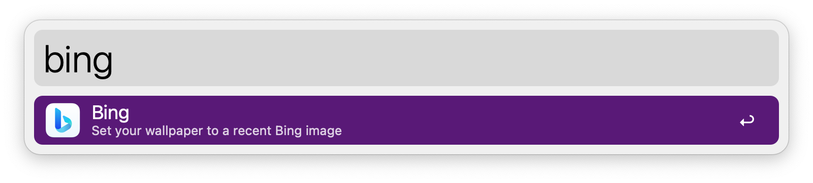
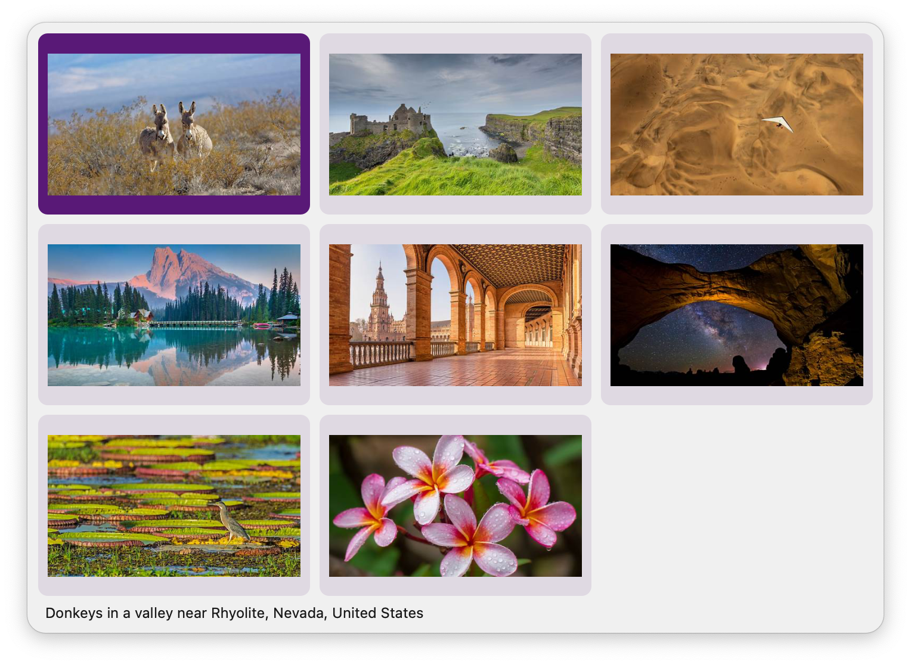

## Usage

List the most recent [Bing Wallpapers](https://bingwallpaper.microsoft.com/) via the `bing` keyword.

* <kbd>↩</kbd> Download image and set it as your wallpaper.
* <kbd>⌘</kbd><kbd>↩</kbd> Open image in web browser.
