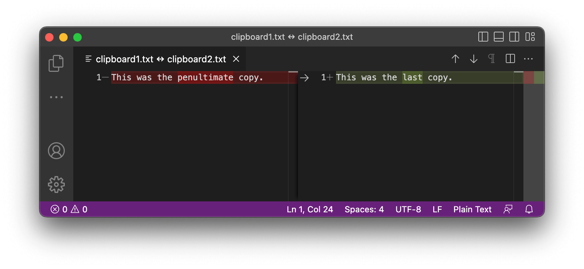

## Setup

Install the Visual Studio Code command-line tool.

In Visual Studio Code: `View` → `Command Palette…` → `Shell Command: Install 'code' command in PATH`.

## Usage

Open Visual Studio Code with a diff of the last two copies via the `vscodediff` keyword.

