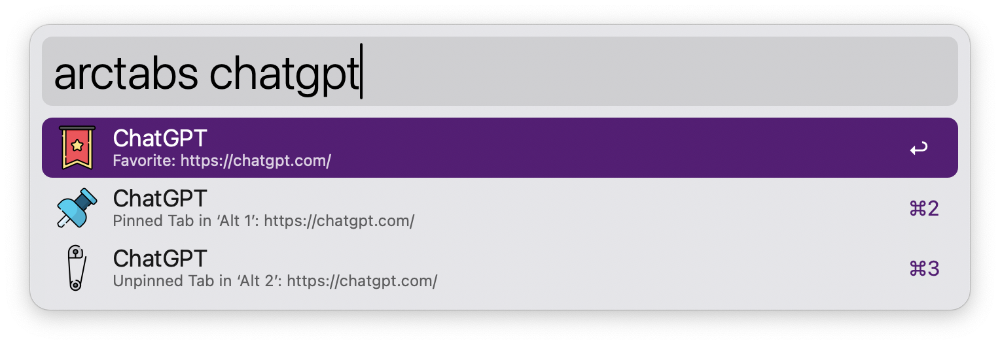
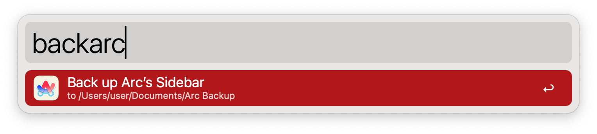
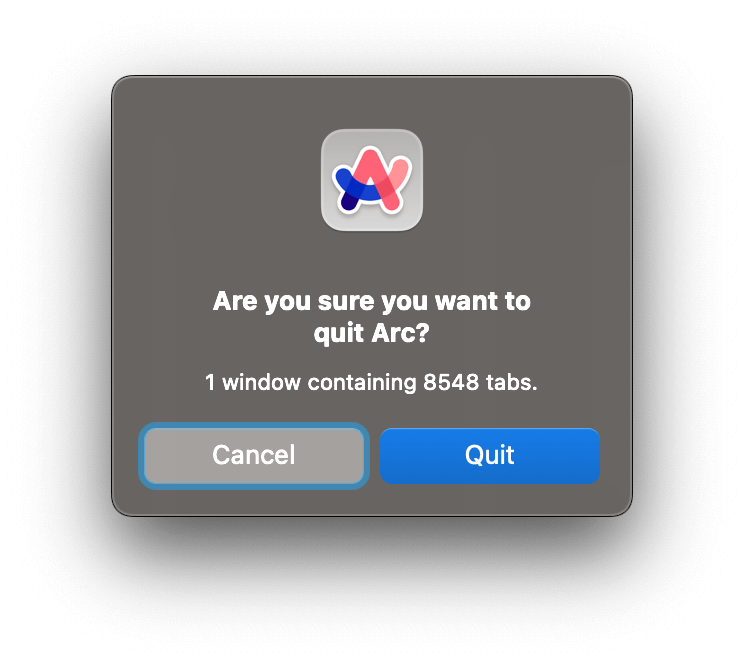

## Usage

Type the configured `Search Keyword` or press <kbd>⌘</kbd><kbd>⇧</kbd><kbd>⌃</kbd><kbd>A</kbd> (configurable) to search for tabs and Spaces. Press Enter on the result to switch to the tab/Space. 

Type the configured `Backup Keyword` to backup all you tabs into an HTML file. Saved to directory configured with the `Back Up Tabs To` keyword.

Use the <kbd>⌘</kbd><kbd>⌃</kbd><kbd>W</kbd> hotkey (also configurable) to show a count open tabs as a quit confirmation.

