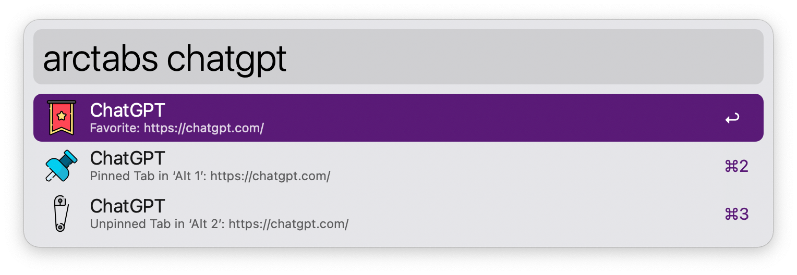
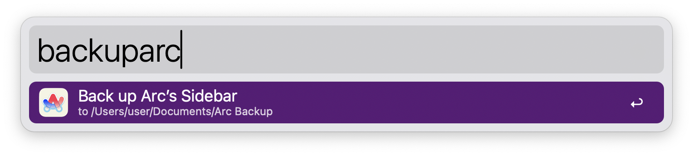
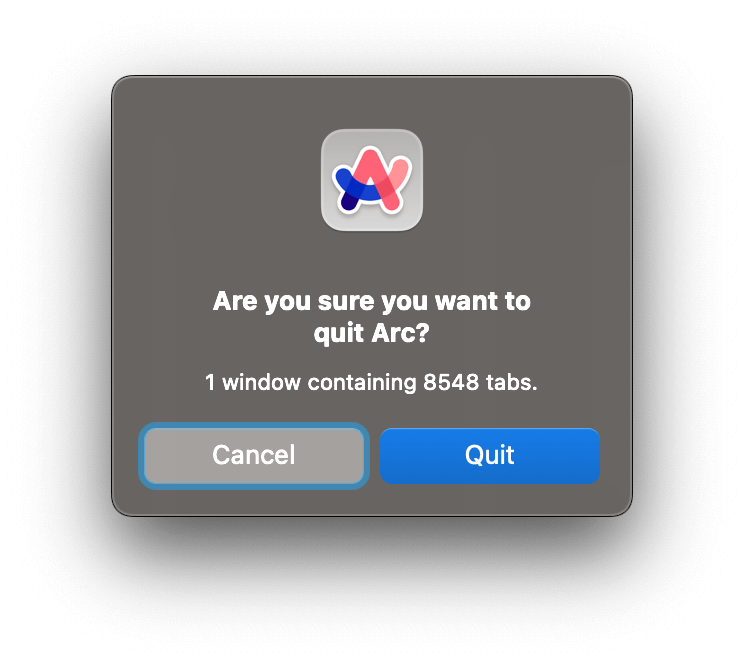

## Usage

Search Arc browser tabs and spaces via the `arctabs` keyword. Press <kbd>↩</kbd> to switch to it.

Back up your tabs to an HTML file with the `backuparc` keyword. Set up where the file is saved to in the Workflow’s Configuration.

Configure the Hotkey as an alternative to close Arc with a confirmation prompt.

