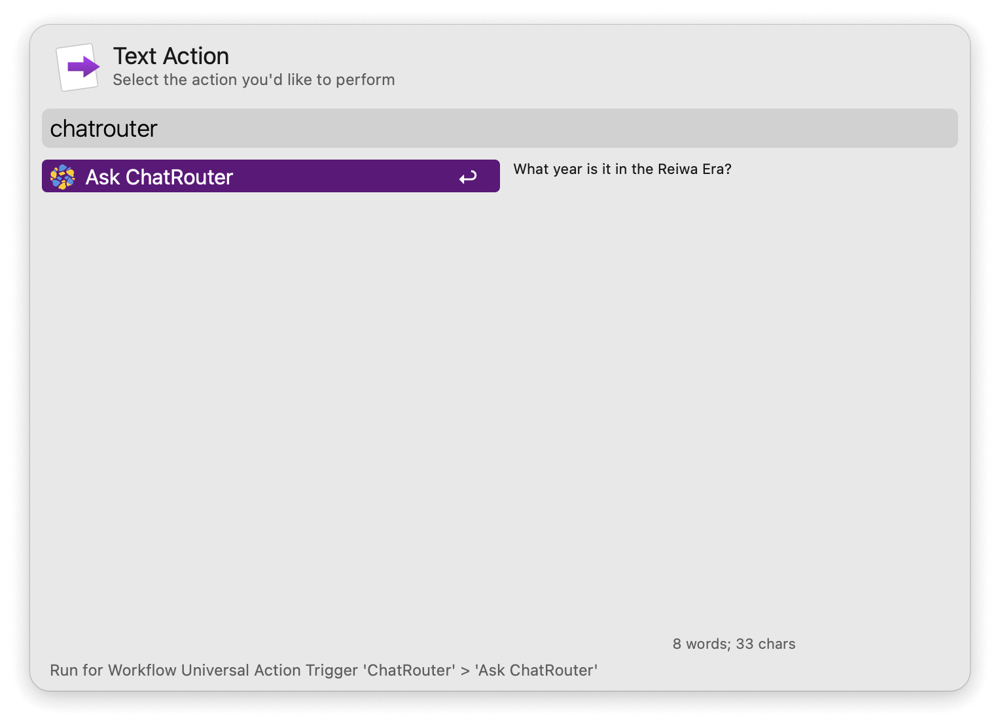

## Setup

1. [Create an OpenRouter account](https://openrouter.ai/sign-up) and sign in.
2. On the [API keys page](https://openrouter.ai/settings/keys), click `Create API key`.
3. Name your new API key and click `Create`.
4. Copy your API key and add it to the Workflow’s Configuration.

## Usage

Start to chat via the `chat` keyword.

* <kbd>↩</kbd> Continue previous chat if any.
* <kbd>⌘</kbd><kbd>↩</kbd> Start a new chat.
* <kbd>⌥</kbd><kbd>↩</kbd> Show a history of chats.

Alternatively, continue chat with selected text via the Universal Action.

* <kbd>⌘</kbd><kbd>↩</kbd> Start a new chat with selection.

* <kbd>↩</kbd> Send your message.
* <kbd>⌘</kbd><kbd>↩</kbd> Start a new chat with your current input.
* <kbd>⌥</kbd><kbd>↩</kbd> Copy last reply from the LLM.
* <kbd>⌃</kbd><kbd>↩</kbd> Copy the full chat as Markdown.
* <kbd>⇧</kbd><kbd>↩</kbd> Stop the streaming reply.

Search for available models from OpenRouter via the `listmodels` keyword.

* <kbd>↩</kbd> Copy model name.
* <kbd>⌘</kbd><kbd>↩</kbd> Use this model for chat.

Query usage for API keys via the `keyusage` keyword.

