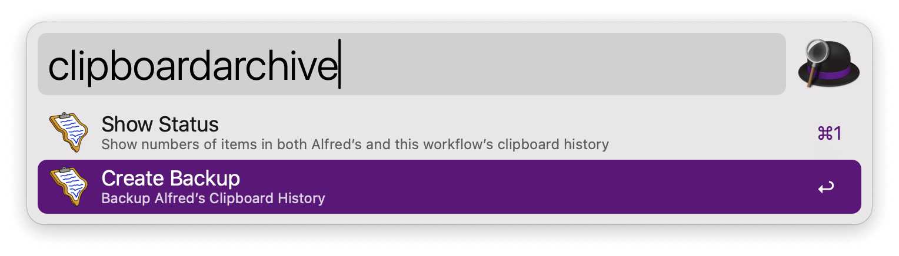

## Usage

Search through backed up clipboard history via the `clipboardsearch` keyword.

* <kbd>↩</kbd> View item.
* <kbd>⌃</kbd><kbd>↩</kbd> Copy item.
* <kbd>⌘</kbd><kbd>↩</kbd> Copy item and paste to frontmost app.

Configure the Hotkey for faster triggering.

Backup Alfred’s Clipboard History via the `clipboardarchive` keyword.

Show current status of Alfred’s and this workflow’s clipboard history via the `clipboardarchive` keyword.

