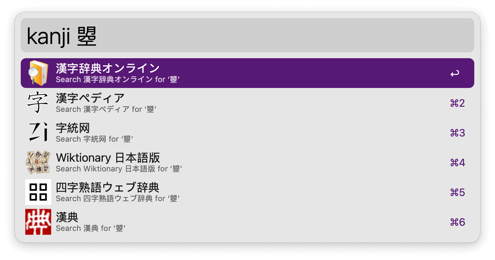
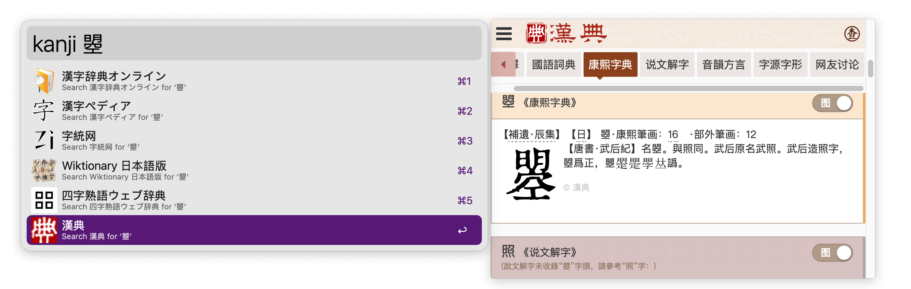
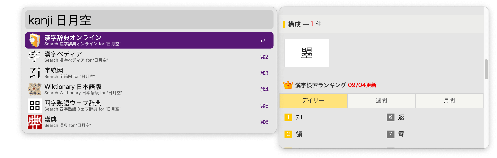

## Usage

Look up kanji in various sources via the `kanji` keyword.

* <kbd>↩</kbd> Open source.
* <kbd>⇧</kbd><kbd>↩</kbd> Copy web link.

Get preview of each source with [AlfredExtraPane](https://github.com/mr-pennyworth/alfred-extra-pane) installed.

If you want to look up a kanji but don’t know how to type it, you can just type each part of the kanji separately. 

E.g., you can type `kanji 日月空` to look up ‘曌’. 

Note that this will only work in the 漢字辞典オンライン source. Find the combined kanji under the ‘構成’ part.
