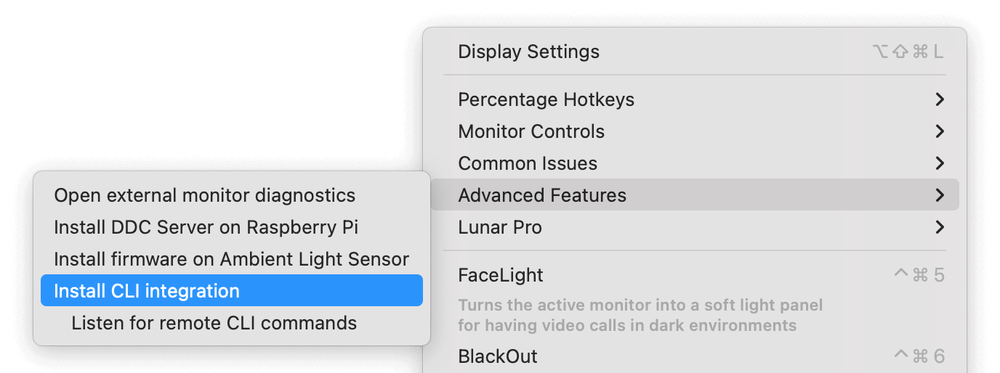
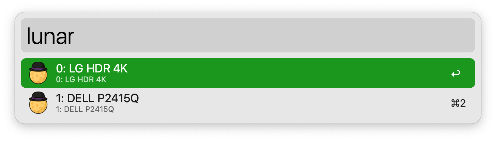
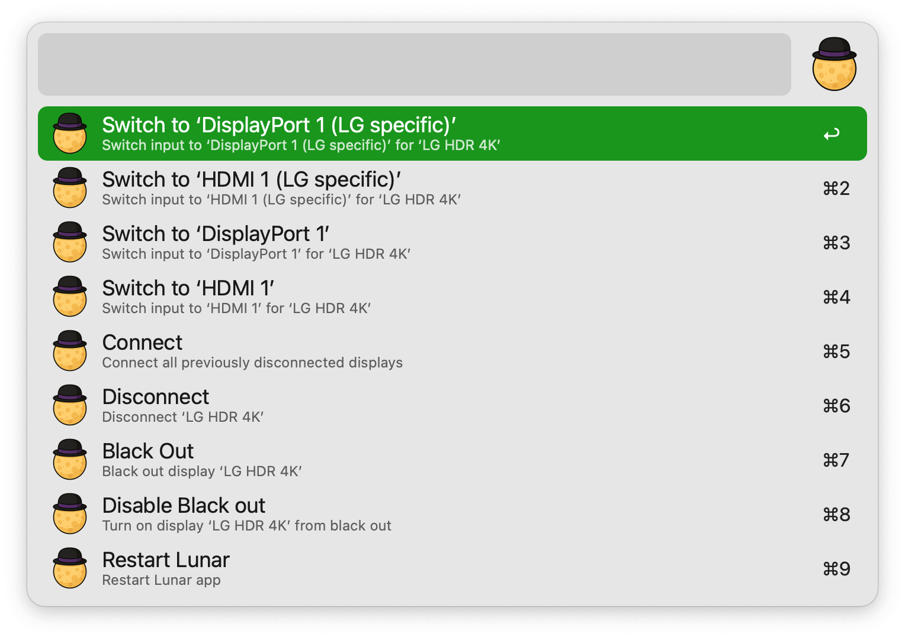

## Setup

Install Lunar CLI by right-clicking Lunar’s menu bar icon and choose Advanced Features → Install CLI integration.

## Usage

List all connected displays via the `lunar` keyword.

* <kbd>↩</kbd> Choose display to take action on.

