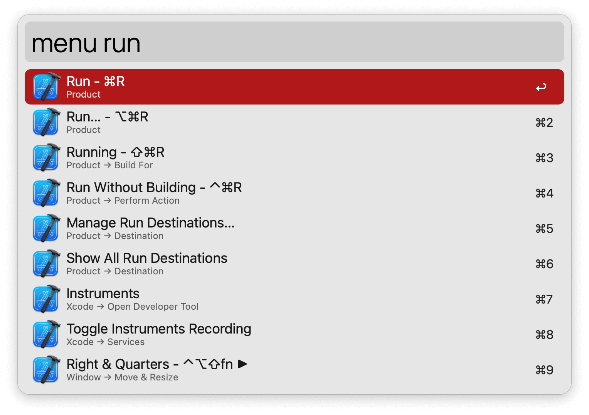
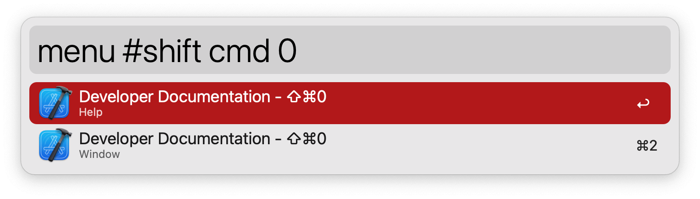

## Usage

Search menu bar items of the frontmost app via the `menu` keyword.

* <kbd>↩</kbd> Action the item.

Configure the Hotkey for faster triggering.

Prepend your query with `#` to search by keyboard shortcut.

Fuzzy searches are supported. For instance, `menu cw` matches the menu item `Close Window`.
